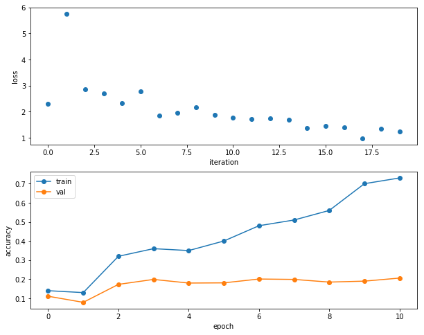

# Convolutional neural networks

In this notebook, we'll put together our convolutional layers to implement a 3-layer CNN.  Then, we'll ask you to implement a CNN that can achieve > 65% validation error on CIFAR-10.

CS231n has built a solid API for building these modular frameworks and training them, and we will use their very well implemented framework as opposed to "reinventing the wheel."  This includes using their Solver, various utility functions, their layer structure, and their implementation of fast CNN layers.  This also includes nndl.fc_net, nndl.layers, and nndl.layer_utils.  As in prior assignments, we thank Serena Yeung & Justin Johnson for permission to use code written for the CS 231n class (cs231n.stanford.edu).  

If you have not completed the Spatial BatchNorm Notebook, please see the following description from that notebook:

Please copy and paste your prior implemented code from HW #4 to start this assignment.  If you did not correctly implement the layers in HW #4, you may collaborate with a classmate to use their layer implementations from HW #4.  You may also visit TA or Prof OH to correct your implementation.  

You'll want to copy and paste from HW #4:
    - layers.py for your FC network layers, as well as batchnorm and dropout.
    - layer_utils.py for your combined FC network layers.
    - optim.py for your optimizers.

Be sure to place these in the `nndl/` directory so they're imported correctly.  Note, as announced in class, we will not be releasing our solutions.


```python
# As usual, a bit of setup

import numpy as np
import matplotlib.pyplot as plt
from nndl.cnn import *
from cs231n.data_utils import get_CIFAR10_data
from cs231n.gradient_check import eval_numerical_gradient_array, eval_numerical_gradient
from nndl.layers import *
from nndl.conv_layers import *
from cs231n.fast_layers import *
from cs231n.solver import Solver

%matplotlib inline
plt.rcParams['figure.figsize'] = (10.0, 8.0) # set default size of plots
plt.rcParams['image.interpolation'] = 'nearest'
plt.rcParams['image.cmap'] = 'gray'

# for auto-reloading external modules
# see http://stackoverflow.com/questions/1907993/autoreload-of-modules-in-ipython
%load_ext autoreload
%autoreload 2

def rel_error(x, y):
  """ returns relative error """
  return np.max(np.abs(x - y) / (np.maximum(1e-8, np.abs(x) + np.abs(y))))
```


```python
# Load the (preprocessed) CIFAR10 data.

data = get_CIFAR10_data()
for k in data.keys():
  print('{}: {} '.format(k, data[k].shape))
```

    y_test: (1000,) 
    X_train: (49000, 3, 32, 32) 
    y_val: (1000,) 
    y_train: (49000,) 
    X_test: (1000, 3, 32, 32) 
    X_val: (1000, 3, 32, 32) 


## Three layer CNN

In this notebook, you will implement a three layer CNN.  The `ThreeLayerConvNet` class is in `nndl/cnn.py`.  You'll need to modify that code for this section, including the initialization, as well as the calculation of the loss and gradients.  You should be able to use the building blocks you have either earlier coded or that we have provided.  Be sure to use the fast layers.

The architecture of this CNN will be:

conv - relu - 2x2 max pool - affine - relu - affine - softmax

We won't use batchnorm yet.  You've also done enough of these to know how to debug; use the cells below.

Note: As we are implementing several layers CNN networks. The gradient error can be expected for the `eval_numerical_gradient()` function. If your `W1 max relative error` and `W2 max relative error` are around or below 0.01, they should be acceptable. Other errors should be less than 1e-5. 


```python
num_inputs = 2
input_dim = (3, 16, 16)
reg = 0.0
num_classes = 10
X = np.random.randn(num_inputs, *input_dim)
y = np.random.randint(num_classes, size=num_inputs)

model = ThreeLayerConvNet(num_filters=3, filter_size=3,
                          input_dim=input_dim, hidden_dim=7,reg = 0.5,
                          dtype=np.float64)
loss, grads = model.loss(X, y)
print(loss)
for param_name in sorted(grads):
    f = lambda _: model.loss(X, y)[0]
    param_grad_num = eval_numerical_gradient(f, model.params[param_name], verbose=False, h=1e-6)
    e = rel_error(param_grad_num, grads[param_name])
    print('{} max relative error: {}'.format(param_name, rel_error(param_grad_num, grads[param_name])))
```

    2.30293806046
    W1 max relative error: 5.3287200902917784e-06
    W2 max relative error: 5.5372076589131316e-05
    W3 max relative error: 1.9514619034368938e-05
    b1 max relative error: 1.3898926432123664e-05
    b2 max relative error: 1.1326801961210015e-07
    b3 max relative error: 1.4089332970634e-09


### Overfit small dataset

To check your CNN implementation, let's overfit a small dataset.


```python
num_train = 100
small_data = {
  'X_train': data['X_train'][:num_train],
  'y_train': data['y_train'][:num_train],
  'X_val': data['X_val'],
  'y_val': data['y_val'],
}

model = ThreeLayerConvNet(weight_scale=1e-2)

solver = Solver(model, small_data,
                num_epochs=10, batch_size=50,
                update_rule='adam',
                optim_config={
                  'learning_rate': 1e-3,
                },
                verbose=True, print_every=1)
solver.train()
```

    (Iteration 1 / 20) loss: 2.298065
    (Epoch 0 / 10) train acc: 0.140000; val_acc: 0.111000
    (Iteration 2 / 20) loss: 5.752372
    (Epoch 1 / 10) train acc: 0.130000; val_acc: 0.079000
    (Iteration 3 / 20) loss: 2.851927
    (Iteration 4 / 20) loss: 2.703952
    (Epoch 2 / 10) train acc: 0.320000; val_acc: 0.173000
    (Iteration 5 / 20) loss: 2.328606
    (Iteration 6 / 20) loss: 2.783772
    (Epoch 3 / 10) train acc: 0.360000; val_acc: 0.199000
    (Iteration 7 / 20) loss: 1.850825
    (Iteration 8 / 20) loss: 1.966538
    (Epoch 4 / 10) train acc: 0.350000; val_acc: 0.180000
    (Iteration 9 / 20) loss: 2.153191
    (Iteration 10 / 20) loss: 1.875127
    (Epoch 5 / 10) train acc: 0.400000; val_acc: 0.181000
    (Iteration 11 / 20) loss: 1.780969
    (Iteration 12 / 20) loss: 1.712593
    (Epoch 6 / 10) train acc: 0.480000; val_acc: 0.201000
    (Iteration 13 / 20) loss: 1.731274
    (Iteration 14 / 20) loss: 1.680493
    (Epoch 7 / 10) train acc: 0.510000; val_acc: 0.199000
    (Iteration 15 / 20) loss: 1.380142
    (Iteration 16 / 20) loss: 1.436825
    (Epoch 8 / 10) train acc: 0.560000; val_acc: 0.185000
    (Iteration 17 / 20) loss: 1.407573
    (Iteration 18 / 20) loss: 0.981924
    (Epoch 9 / 10) train acc: 0.700000; val_acc: 0.190000
    (Iteration 19 / 20) loss: 1.340732
    (Iteration 20 / 20) loss: 1.225642
    (Epoch 10 / 10) train acc: 0.730000; val_acc: 0.206000


```python
plt.subplot(2, 1, 1)
plt.plot(solver.loss_history, 'o')
plt.xlabel('iteration')
plt.ylabel('loss')

plt.subplot(2, 1, 2)
plt.plot(solver.train_acc_history, '-o')
plt.plot(solver.val_acc_history, '-o')
plt.legend(['train', 'val'], loc='upper left')
plt.xlabel('epoch')
plt.ylabel('accuracy')
plt.show()
```





## Train the network

Now we train the 3 layer CNN on CIFAR-10 and assess its accuracy.


```python
model = ThreeLayerConvNet(weight_scale=0.001, hidden_dim=500, reg=0.001)

solver = Solver(model, data,
                num_epochs=1, batch_size=50,
                update_rule='adam',
                optim_config={
                  'learning_rate': 1e-3,
                },
                verbose=True, print_every=20)
solver.train()
```

    (Iteration 1 / 980) loss: 2.304831
    (Epoch 0 / 1) train acc: 0.092000; val_acc: 0.105000
    (Iteration 21 / 980) loss: 1.996945
    (Iteration 41 / 980) loss: 2.164343
    (Iteration 61 / 980) loss: 1.966932
    (Iteration 81 / 980) loss: 2.096401
    (Iteration 101 / 980) loss: 1.945771
    (Iteration 121 / 980) loss: 2.001554
    (Iteration 141 / 980) loss: 1.774257
    (Iteration 161 / 980) loss: 1.898888
    (Iteration 181 / 980) loss: 1.872793
    (Iteration 201 / 980) loss: 1.590161
    (Iteration 221 / 980) loss: 1.671499
    (Iteration 241 / 980) loss: 1.929113
    (Iteration 261 / 980) loss: 2.037842
    (Iteration 281 / 980) loss: 1.802522
    (Iteration 301 / 980) loss: 1.723093
    (Iteration 321 / 980) loss: 1.625739
    (Iteration 341 / 980) loss: 1.774984
    (Iteration 361 / 980) loss: 1.724849
    (Iteration 381 / 980) loss: 1.488926
    (Iteration 401 / 980) loss: 1.573739
    (Iteration 421 / 980) loss: 1.723887
    (Iteration 441 / 980) loss: 1.508812
    (Iteration 461 / 980) loss: 1.438466
    (Iteration 481 / 980) loss: 1.533829
    (Iteration 501 / 980) loss: 1.904903
    (Iteration 521 / 980) loss: 1.442231
    (Iteration 541 / 980) loss: 1.803634
    (Iteration 561 / 980) loss: 1.555259
    (Iteration 581 / 980) loss: 1.347561
    (Iteration 601 / 980) loss: 1.404874
    (Iteration 621 / 980) loss: 1.665076
    (Iteration 641 / 980) loss: 1.386513
    (Iteration 661 / 980) loss: 1.437429
    (Iteration 681 / 980) loss: 1.481472
    (Iteration 701 / 980) loss: 1.698554
    (Iteration 721 / 980) loss: 1.479493
    (Iteration 741 / 980) loss: 1.339297
    (Iteration 761 / 980) loss: 1.138838
    (Iteration 781 / 980) loss: 1.730660
    (Iteration 801 / 980) loss: 1.749638
    (Iteration 821 / 980) loss: 1.689794
    (Iteration 841 / 980) loss: 1.503719
    (Iteration 861 / 980) loss: 1.522377
    (Iteration 881 / 980) loss: 1.304774
    (Iteration 901 / 980) loss: 1.429380
    (Iteration 921 / 980) loss: 1.478626
    (Iteration 941 / 980) loss: 1.968533
    (Iteration 961 / 980) loss: 1.394734
    (Epoch 1 / 1) train acc: 0.473000; val_acc: 0.480000


# Get > 65% validation accuracy on CIFAR-10.

In the last part of the assignment, we'll now ask you to train a CNN to get better than 65% validation accuracy on CIFAR-10.

### Things you should try:
- Filter size: Above we used 7x7; but VGGNet and onwards showed stacks of 3x3 filters are good.  
- Number of filters: Above we used 32 filters. Do more or fewer do better?
- Batch normalization: Try adding spatial batch normalization after convolution layers and vanilla batch normalization aafter affine layers. Do your networks train faster?
- Network architecture: Can a deeper CNN do better?  Consider these architectures:
    - [conv-relu-pool]xN - conv - relu - [affine]xM - [softmax or SVM]
    - [conv-relu-pool]XN - [affine]XM - [softmax or SVM]
    - [conv-relu-conv-relu-pool]xN - [affine]xM - [softmax or SVM]

### Tips for training
For each network architecture that you try, you should tune the learning rate and regularization strength. When doing this there are a couple important things to keep in mind:

- If the parameters are working well, you should see improvement within a few hundred iterations
- Remember the coarse-to-fine approach for hyperparameter tuning: start by testing a large range of hyperparameters for just a few training iterations to find the combinations of parameters that are working at all.
- Once you have found some sets of parameters that seem to work, search more finely around these parameters. You may need to train for more epochs.


```python
# ================================================================ #
# YOUR CODE HERE:
#   Implement a CNN to achieve greater than 65% validation accuracy
#   on CIFAR-10.
# ================================================================ #

# Notes:
# - I added early stopping in solver.py, so that it would stop when printing out the val_acc if the val_acc was > 0.65
# so I wouldn't have to wait for all the epochs to finish.
# My intuition for these parameters was to increase the number of filters and try  a smaller filter size,
# while also increasing the hidden dim size to improve expressivity, and adding regularization to prevent overfitting.
# I chose a filter size of 5 as opposed to 3 because I thought 3 would incur too small of a receptive field
# (unless I stacked several layers of 3 x 3 convs), so I went with 5 x 5 filters. 
# I also increased the batch size and slightly decreased the learning rate. 
model = ThreeLayerConvNet(weight_scale=0.001, num_filters=100, filter_size = 5, hidden_dim=900, reg=0.003)

solver = Solver(model, data,
                num_epochs=8, batch_size=100,
                update_rule='adam',
                optim_config={
                  'learning_rate': 3e-4, 
                },
                verbose=True, print_every=25)
solver.train()

# ================================================================ #
# END YOUR CODE HERE
# ================================================================ #

```

    (Iteration 1 / 3920) loss: 2.337350
    (Epoch 0 / 8) train acc: 0.108000; val_acc: 0.099000
    (Iteration 26 / 3920) loss: 1.878207
    (Iteration 51 / 3920) loss: 1.571781
    (Iteration 76 / 3920) loss: 1.849362
    (Iteration 101 / 3920) loss: 1.484025
    (Iteration 126 / 3920) loss: 1.380924
    (Iteration 151 / 3920) loss: 1.775085
    (Iteration 176 / 3920) loss: 1.700852
    (Iteration 201 / 3920) loss: 1.526648
    (Iteration 226 / 3920) loss: 1.523147
    (Iteration 251 / 3920) loss: 1.434565
    (Iteration 276 / 3920) loss: 1.645479
    (Iteration 301 / 3920) loss: 1.478539
    (Iteration 326 / 3920) loss: 1.482107
    (Iteration 351 / 3920) loss: 1.500093
    (Iteration 376 / 3920) loss: 1.584182
    (Iteration 401 / 3920) loss: 1.296134
    (Iteration 426 / 3920) loss: 1.457971
    (Iteration 451 / 3920) loss: 1.288677
    (Iteration 476 / 3920) loss: 1.278795
    (Epoch 1 / 8) train acc: 0.554000; val_acc: 0.545000
    (Iteration 501 / 3920) loss: 1.199579
    (Iteration 526 / 3920) loss: 1.373353
    (Iteration 551 / 3920) loss: 1.305344
    (Iteration 576 / 3920) loss: 1.217890
    (Iteration 601 / 3920) loss: 1.202418
    (Iteration 626 / 3920) loss: 1.329121
    (Iteration 651 / 3920) loss: 1.185285
    (Iteration 676 / 3920) loss: 1.198976
    (Iteration 701 / 3920) loss: 1.181079
    (Iteration 726 / 3920) loss: 1.248037
    (Iteration 751 / 3920) loss: 1.140215
    (Iteration 776 / 3920) loss: 1.427253
    (Iteration 801 / 3920) loss: 1.062041
    (Iteration 826 / 3920) loss: 1.467058
    (Iteration 851 / 3920) loss: 1.084974
    (Iteration 876 / 3920) loss: 1.337001
    (Iteration 901 / 3920) loss: 1.181214
    (Iteration 926 / 3920) loss: 1.031273
    (Iteration 951 / 3920) loss: 1.334880
    (Iteration 976 / 3920) loss: 1.145860
    (Epoch 2 / 8) train acc: 0.663000; val_acc: 0.631000
    (Iteration 1001 / 3920) loss: 1.034773
    (Iteration 1026 / 3920) loss: 1.095234
    (Iteration 1051 / 3920) loss: 1.011024
    (Iteration 1076 / 3920) loss: 1.095320
    (Iteration 1101 / 3920) loss: 1.104447
    (Iteration 1126 / 3920) loss: 1.115571
    (Iteration 1151 / 3920) loss: 1.128013
    (Iteration 1176 / 3920) loss: 1.103496
    (Iteration 1201 / 3920) loss: 1.130454
    (Iteration 1226 / 3920) loss: 1.217309
    (Iteration 1251 / 3920) loss: 1.059150
    (Iteration 1276 / 3920) loss: 1.062433
    (Iteration 1301 / 3920) loss: 0.868521
    (Iteration 1326 / 3920) loss: 1.241937
    (Iteration 1351 / 3920) loss: 1.448535
    (Iteration 1376 / 3920) loss: 1.058013
    (Iteration 1401 / 3920) loss: 0.978006
    (Iteration 1426 / 3920) loss: 1.284407
    (Iteration 1451 / 3920) loss: 1.057749
    (Epoch 3 / 8) train acc: 0.703000; val_acc: 0.613000
    (Iteration 1476 / 3920) loss: 1.211940
    (Iteration 1501 / 3920) loss: 0.943988
    (Iteration 1526 / 3920) loss: 1.068278
    (Iteration 1551 / 3920) loss: 1.102971
    (Iteration 1576 / 3920) loss: 1.094317
    (Iteration 1601 / 3920) loss: 0.929161
    (Iteration 1626 / 3920) loss: 1.078868
    (Iteration 1651 / 3920) loss: 0.932311
    (Iteration 1676 / 3920) loss: 1.120827
    (Iteration 1701 / 3920) loss: 1.089434
    (Iteration 1726 / 3920) loss: 1.051783
    (Iteration 1751 / 3920) loss: 1.139698
    (Iteration 1776 / 3920) loss: 0.982817
    (Iteration 1801 / 3920) loss: 0.915203
    (Iteration 1826 / 3920) loss: 1.039618
    (Iteration 1851 / 3920) loss: 0.987972
    (Iteration 1876 / 3920) loss: 1.030472
    (Iteration 1901 / 3920) loss: 0.967440
    (Iteration 1926 / 3920) loss: 0.899905
    (Iteration 1951 / 3920) loss: 1.141897
    (Epoch 4 / 8) train acc: 0.719000; val_acc: 0.652000


```python

```
