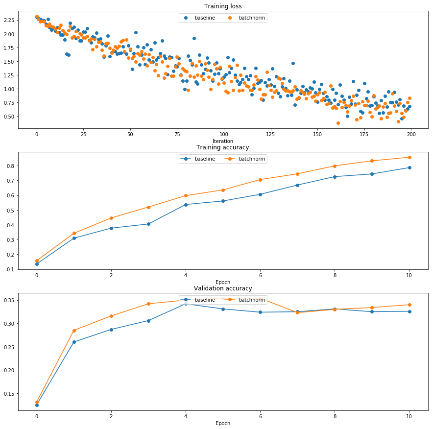
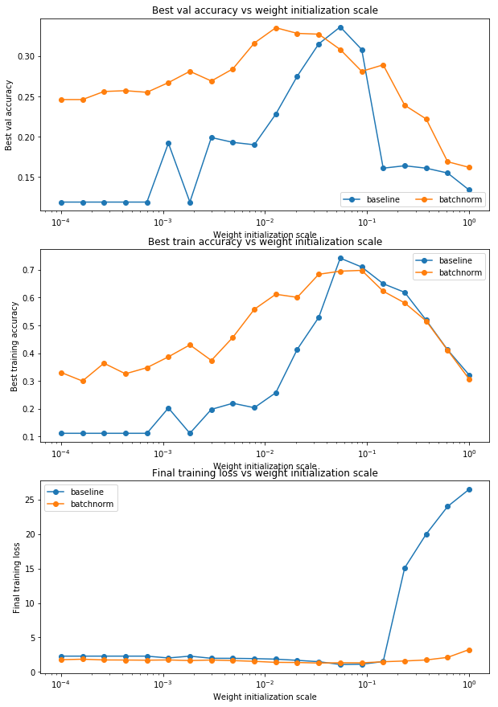

# Batch Normalization

In this notebook, you will implement the batch normalization layers of a neural network to increase its performance.  If you have any confusion, please review the details of batch normalization from the lecture notes.

CS231n has built a solid API for building these modular frameworks and training them, and we will use their very well implemented framework as opposed to "reinventing the wheel."  This includes using their Solver, various utility functions, and their layer structure.  This also includes nndl.fc_net, nndl.layers, and nndl.layer_utils.  As in prior assignments, we thank Serena Yeung & Justin Johnson for permission to use code written for the CS 231n class (cs231n.stanford.edu).  


```python
## Import and setups

import time
import numpy as np
import matplotlib.pyplot as plt
from nndl.fc_net import *
from nndl.layers import *
from cs231n.data_utils import get_CIFAR10_data
from cs231n.gradient_check import eval_numerical_gradient, eval_numerical_gradient_array
from cs231n.solver import Solver

%matplotlib inline
plt.rcParams['figure.figsize'] = (10.0, 8.0) # set default size of plots
plt.rcParams['image.interpolation'] = 'nearest'
plt.rcParams['image.cmap'] = 'gray'

# for auto-reloading external modules
# see http://stackoverflow.com/questions/1907993/autoreload-of-modules-in-ipython
%load_ext autoreload
%autoreload 2

def rel_error(x, y):
  """ returns relative error """
  return np.max(np.abs(x - y) / (np.maximum(1e-8, np.abs(x) + np.abs(y))))
```


```python
# Load the (preprocessed) CIFAR10 data.

data = get_CIFAR10_data()
for k in data.keys():
  print('{}: {} '.format(k, data[k].shape))
```

    X_train: (49000, 3, 32, 32) 
    X_val: (1000, 3, 32, 32) 
    y_val: (1000,) 
    y_test: (1000,) 
    X_test: (1000, 3, 32, 32) 
    y_train: (49000,) 


## Batchnorm forward pass

Implement the training time batchnorm forward pass, `batchnorm_forward`, in `nndl/layers.py`. After that, test your implementation by running the following cell.


```python
# Check the training-time forward pass by checking means and variances
# of features both before and after batch normalization

# Simulate the forward pass for a two-layer network
N, D1, D2, D3 = 200, 50, 60, 3
X = np.random.randn(N, D1)
W1 = np.random.randn(D1, D2)
W2 = np.random.randn(D2, D3)
a = np.maximum(0, X.dot(W1)).dot(W2)

print('Before batch normalization:')
print('  means: ', a.mean(axis=0))
print('  stds: ', a.std(axis=0))

# Means should be close to zero and stds close to one
print('After batch normalization (gamma=1, beta=0)')
a_norm, _ = batchnorm_forward(a, np.ones(D3), np.zeros(D3), {'mode': 'train'})
print('  mean: ', a_norm.mean(axis=0))
print('  std: ', a_norm.std(axis=0))

# Now means should be close to beta and stds close to gamma
gamma = np.asarray([1.0, 2.0, 3.0])
beta = np.asarray([11.0, 12.0, 13.0])
a_norm, _ = batchnorm_forward(a, gamma, beta, {'mode': 'train'})
print('After batch normalization (nontrivial gamma, beta)')
print('  means: ', a_norm.mean(axis=0))
print('  stds: ', a_norm.std(axis=0))
```

    Before batch normalization:
      means:  [ -8.04755829  -5.89418957  35.90712494]
      stds:  [ 32.66390922  28.86568904  38.56396995]
    After batch normalization (gamma=1, beta=0)
      mean:  [ -1.92762473e-16  -1.08801856e-16   3.55271368e-17]
      std:  [ 1.          0.99999999  1.        ]
    After batch normalization (nontrivial gamma, beta)
      means:  [ 11.  12.  13.]
      stds:  [ 1.          1.99999999  2.99999999]


Implement the testing time batchnorm forward pass, `batchnorm_forward`, in `nndl/layers.py`. After that, test your implementation by running the following cell.


```python
# Check the test-time forward pass by running the training-time
# forward pass many times to warm up the running averages, and then
# checking the means and variances of activations after a test-time
# forward pass.

N, D1, D2, D3 = 200, 50, 60, 3
W1 = np.random.randn(D1, D2)
W2 = np.random.randn(D2, D3)

bn_param = {'mode': 'train'}
gamma = np.ones(D3)
beta = np.zeros(D3)
for t in np.arange(50):
  X = np.random.randn(N, D1)
  a = np.maximum(0, X.dot(W1)).dot(W2)
  batchnorm_forward(a, gamma, beta, bn_param)
bn_param['mode'] = 'test'
X = np.random.randn(N, D1)
a = np.maximum(0, X.dot(W1)).dot(W2)
a_norm, _ = batchnorm_forward(a, gamma, beta, bn_param)

# Means should be close to zero and stds close to one, but will be
# noisier than training-time forward passes.
print('After batch normalization (test-time):')
print('  means: ', a_norm.mean(axis=0))
print('  stds: ', a_norm.std(axis=0))
```

    After batch normalization (test-time):
      means:  [ 0.09208205  0.11855009 -0.00840963]
      stds:  [ 0.93735292  0.96884493  0.93294292]


## Batchnorm backward pass

Implement the backward pass for the batchnorm layer, `batchnorm_backward` in `nndl/layers.py`.  Check your implementation by running the following cell.


```python
# Gradient check batchnorm backward pass

N, D = 4, 5
x = 5 * np.random.randn(N, D) + 12
gamma = np.random.randn(D)
beta = np.random.randn(D)
dout = np.random.randn(N, D)

bn_param = {'mode': 'train'}
fx = lambda x: batchnorm_forward(x, gamma, beta, bn_param)[0]
fg = lambda a: batchnorm_forward(x, gamma, beta, bn_param)[0]
fb = lambda b: batchnorm_forward(x, gamma, beta, bn_param)[0]

dx_num = eval_numerical_gradient_array(fx, x, dout)
da_num = eval_numerical_gradient_array(fg, gamma, dout)
db_num = eval_numerical_gradient_array(fb, beta, dout)

_, cache = batchnorm_forward(x, gamma, beta, bn_param)
dx, dgamma, dbeta = batchnorm_backward(dout, cache)
print('dx error: ', rel_error(dx_num, dx))
print('dgamma error: ', rel_error(da_num, dgamma))
print('dbeta error: ', rel_error(db_num, dbeta))
```

    dx error:  4.99054391162e-09
    dgamma error:  1.06105529425e-10
    dbeta error:  3.27547088128e-12


## Implement a fully connected neural network with batchnorm layers

Modify the `FullyConnectedNet()` class in `nndl/fc_net.py` to incorporate batchnorm layers.  You will need to modify the class in the following areas:

(1) The gammas and betas need to be initialized to 1's and 0's respectively in `__init__`.

(2) The `batchnorm_forward` layer needs to be inserted between each affine and relu layer (except in the output layer) in a forward pass computation in `loss`.  You may find it helpful to write an `affine_batchnorm_relu()` layer in `nndl/layer_utils.py` although this is not necessary.

(3) The `batchnorm_backward` layer has to be appropriately inserted when calculating gradients.

After you have done the appropriate modifications, check your implementation by running the following cell.

Note, while the relative error for W3 should be small, as we backprop gradients more, you may find the relative error increases.  Our relative error for W1 is on the order of 1e-4.


```python

```


```python
N, D, H1, H2, C = 2, 15, 20, 30, 10
X = np.random.randn(N, D)
y = np.random.randint(C, size=(N,))

for reg in [0, 3.14]:
  print('Running check with reg = ', reg)
  model = FullyConnectedNet([H1,H2], input_dim=D, num_classes=C,
                            reg=reg, weight_scale=5e-2, dtype=np.float64,
                            use_batchnorm=True)

  loss, grads = model.loss(X, y)
  print('Initial loss: ', loss)

  for name in sorted(grads):
    f = lambda _: model.loss(X, y)[0]
    grad_num = eval_numerical_gradient(f, model.params[name], verbose=False, h=1e-5)
    print('{} relative error: {}'.format(name, rel_error(grad_num, grads[name])))
  if reg == 0: print('\n')
```

    Running check with reg =  0
    Initial loss:  2.3959896591
    W1 relative error: 4.307893465681835e-05
    W2 relative error: 3.4315350893100184e-10
    b1 relative error: 1.3877787807814457e-08
    b2 relative error: 1.1058218030224465e-10
    beta1 relative error: 7.462164938200874e-09
    gamma1 relative error: 8.462025998324458e-09
    
    
    Running check with reg =  3.14
    Initial loss:  4.30925247408
    W1 relative error: 2.6336080151491735e-06
    W2 relative error: 7.142575980781762e-09
    b1 relative error: 2.3314683517128287e-07
    b2 relative error: 1.5870665080090962e-10
    beta1 relative error: 5.878380892697289e-09
    gamma1 relative error: 3.884073057140716e-09


## Training a deep fully connected network with batch normalization.

To see if batchnorm helps, let's train a deep neural network with and without batch normalization.


```python
# Try training a very deep net with batchnorm
hidden_dims = [100, 100, 100, 100, 100]

num_train = 1000
small_data = {
  'X_train': data['X_train'][:num_train],
  'y_train': data['y_train'][:num_train],
  'X_val': data['X_val'],
  'y_val': data['y_val'],
}

weight_scale = 2e-2
bn_model = FullyConnectedNet(hidden_dims, weight_scale=weight_scale, use_batchnorm=True)
model = FullyConnectedNet(hidden_dims, weight_scale=weight_scale, use_batchnorm=False)

bn_solver = Solver(bn_model, small_data,
                num_epochs=10, batch_size=50,
                update_rule='adam',
                optim_config={
                  'learning_rate': 1e-3,
                },
                verbose=True, print_every=200)
bn_solver.train()

solver = Solver(model, small_data,
                num_epochs=10, batch_size=50,
                update_rule='adam',
                optim_config={
                  'learning_rate': 1e-3,
                },
                verbose=True, print_every=200)
solver.train()
```

    (Iteration 1 / 200) loss: 2.315555
    (Epoch 0 / 10) train acc: 0.156000; val_acc: 0.131000
    (Epoch 1 / 10) train acc: 0.342000; val_acc: 0.285000
    (Epoch 2 / 10) train acc: 0.446000; val_acc: 0.316000
    (Epoch 3 / 10) train acc: 0.520000; val_acc: 0.342000
    (Epoch 4 / 10) train acc: 0.597000; val_acc: 0.350000
    (Epoch 5 / 10) train acc: 0.636000; val_acc: 0.354000
    (Epoch 6 / 10) train acc: 0.706000; val_acc: 0.354000
    (Epoch 7 / 10) train acc: 0.745000; val_acc: 0.323000
    (Epoch 8 / 10) train acc: 0.799000; val_acc: 0.330000
    (Epoch 9 / 10) train acc: 0.833000; val_acc: 0.334000
    (Epoch 10 / 10) train acc: 0.857000; val_acc: 0.340000
    (Iteration 1 / 200) loss: 2.304016
    (Epoch 0 / 10) train acc: 0.134000; val_acc: 0.125000
    (Epoch 1 / 10) train acc: 0.309000; val_acc: 0.260000
    (Epoch 2 / 10) train acc: 0.377000; val_acc: 0.287000
    (Epoch 3 / 10) train acc: 0.405000; val_acc: 0.306000
    (Epoch 4 / 10) train acc: 0.537000; val_acc: 0.342000
    (Epoch 5 / 10) train acc: 0.561000; val_acc: 0.331000
    (Epoch 6 / 10) train acc: 0.606000; val_acc: 0.324000
    (Epoch 7 / 10) train acc: 0.669000; val_acc: 0.325000
    (Epoch 8 / 10) train acc: 0.726000; val_acc: 0.331000
    (Epoch 9 / 10) train acc: 0.744000; val_acc: 0.325000
    (Epoch 10 / 10) train acc: 0.787000; val_acc: 0.326000


```python
plt.subplot(3, 1, 1)
plt.title('Training loss')
plt.xlabel('Iteration')

plt.subplot(3, 1, 2)
plt.title('Training accuracy')
plt.xlabel('Epoch')

plt.subplot(3, 1, 3)
plt.title('Validation accuracy')
plt.xlabel('Epoch')

plt.subplot(3, 1, 1)
plt.plot(solver.loss_history, 'o', label='baseline')
plt.plot(bn_solver.loss_history, 'o', label='batchnorm')

plt.subplot(3, 1, 2)
plt.plot(solver.train_acc_history, '-o', label='baseline')
plt.plot(bn_solver.train_acc_history, '-o', label='batchnorm')

plt.subplot(3, 1, 3)
plt.plot(solver.val_acc_history, '-o', label='baseline')
plt.plot(bn_solver.val_acc_history, '-o', label='batchnorm')
  
for i in [1, 2, 3]:
  plt.subplot(3, 1, i)
  plt.legend(loc='upper center', ncol=4)
plt.gcf().set_size_inches(15, 15)
plt.show()
```





## Batchnorm and initialization

The following cells run an experiment where for a deep network, the initialization is varied.  We do training for when batchnorm layers are and are not included.


```python
# Try training a very deep net with batchnorm
hidden_dims = [50, 50, 50, 50, 50, 50, 50]

num_train = 1000
small_data = {
  'X_train': data['X_train'][:num_train],
  'y_train': data['y_train'][:num_train],
  'X_val': data['X_val'],
  'y_val': data['y_val'],
}

bn_solvers = {}
solvers = {}
weight_scales = np.logspace(-4, 0, num=20)
for i, weight_scale in enumerate(weight_scales):
  print('Running weight scale {} / {}'.format(i + 1, len(weight_scales)))
  bn_model = FullyConnectedNet(hidden_dims, weight_scale=weight_scale, use_batchnorm=True)
  model = FullyConnectedNet(hidden_dims, weight_scale=weight_scale, use_batchnorm=False)

  bn_solver = Solver(bn_model, small_data,
                  num_epochs=10, batch_size=50,
                  update_rule='adam',
                  optim_config={
                    'learning_rate': 1e-3,
                  },
                  verbose=False, print_every=200)
  bn_solver.train()
  bn_solvers[weight_scale] = bn_solver

  solver = Solver(model, small_data,
                  num_epochs=10, batch_size=50,
                  update_rule='adam',
                  optim_config={
                    'learning_rate': 1e-3,
                  },
                  verbose=False, print_every=200)
  solver.train()
  solvers[weight_scale] = solver
```

    Running weight scale 1 / 20
    Running weight scale 2 / 20
    Running weight scale 3 / 20
    Running weight scale 4 / 20
    Running weight scale 5 / 20
    Running weight scale 6 / 20
    Running weight scale 7 / 20
    Running weight scale 8 / 20
    Running weight scale 9 / 20
    Running weight scale 10 / 20
    Running weight scale 11 / 20
    Running weight scale 12 / 20
    Running weight scale 13 / 20
    Running weight scale 14 / 20
    Running weight scale 15 / 20
    Running weight scale 16 / 20
    Running weight scale 17 / 20
    Running weight scale 18 / 20
    Running weight scale 19 / 20
    Running weight scale 20 / 20


```python
# Plot results of weight scale experiment
best_train_accs, bn_best_train_accs = [], []
best_val_accs, bn_best_val_accs = [], []
final_train_loss, bn_final_train_loss = [], []

for ws in weight_scales:
  best_train_accs.append(max(solvers[ws].train_acc_history))
  bn_best_train_accs.append(max(bn_solvers[ws].train_acc_history))
  
  best_val_accs.append(max(solvers[ws].val_acc_history))
  bn_best_val_accs.append(max(bn_solvers[ws].val_acc_history))
  
  final_train_loss.append(np.mean(solvers[ws].loss_history[-100:]))
  bn_final_train_loss.append(np.mean(bn_solvers[ws].loss_history[-100:]))
  
plt.subplot(3, 1, 1)
plt.title('Best val accuracy vs weight initialization scale')
plt.xlabel('Weight initialization scale')
plt.ylabel('Best val accuracy')
plt.semilogx(weight_scales, best_val_accs, '-o', label='baseline')
plt.semilogx(weight_scales, bn_best_val_accs, '-o', label='batchnorm')
plt.legend(ncol=2, loc='lower right')

plt.subplot(3, 1, 2)
plt.title('Best train accuracy vs weight initialization scale')
plt.xlabel('Weight initialization scale')
plt.ylabel('Best training accuracy')
plt.semilogx(weight_scales, best_train_accs, '-o', label='baseline')
plt.semilogx(weight_scales, bn_best_train_accs, '-o', label='batchnorm')
plt.legend()

plt.subplot(3, 1, 3)
plt.title('Final training loss vs weight initialization scale')
plt.xlabel('Weight initialization scale')
plt.ylabel('Final training loss')
plt.semilogx(weight_scales, final_train_loss, '-o', label='baseline')
plt.semilogx(weight_scales, bn_final_train_loss, '-o', label='batchnorm')
plt.legend()

plt.gcf().set_size_inches(10, 15)
plt.show()
```





## Question:

In the cell below, summarize the findings of this experiment, and WHY these results make sense.

## Answer:

This experiment indicated that using batch normalization yields a lower training loss and better training and validation accuracies compared to no batch normalization, at several different weight initialization schemes. In particular, batch normalization works better when the weights are initialized "poorly" - which could be too small, too large, or with high variance.

This indicates that batch normalization in our network causes our network to be less dependent on careful initialization of weights, whereas if we didn't use batch normalization, we'd need to be very careful about how we initialize our weights (i.e. maybe with Xavier or He), in order for learning to work. This makes sense since batch normalization normalizes our outputs layer to layer, resulting in activations with roughly unit variance, so all the activations do not go to zero. This in turn causes larger gradients to be backpropagated and learning to occur, whereas without batch normalization, poor weight initialization may lead to vanishing gradients.


```python

```
