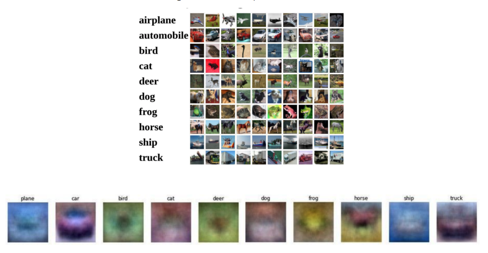

### Lecture 3: Linear Classifiers

#### Reminder from Last time

- In ML estimation we want ot max the lieklihood of having seen the dataset
- $L = p({x^1, y^1}, … {x^n, y^n})$
- Other cost functions:
  - MAP esimation: where we place a prior distribution on our parameters
  - KL divergence: We think of our scores from our model as a distribution, and the true labels as a distribution, and minimize that
  - Maximize an approximate of the data generating distribution
- Usually we have cost functions that we can't get closed form parameters for, so we use gradient descent to minimize instead

#### Image Classification

- Important computer vision task
- Viewpoint variation, bounding boxes, illumination, etc are challenging problems
- Data driven approach: train: data -> model params, test: model -> prediction

#### KNN approach

- Pick a distance metric $d(x, y)$
- choose $K$, the number of nearest neighbors
  - usually done w/cross validation in practice
- Go through the dataset and get k closest neighbors, use majority for voting.
- pros: const time training, simple. Cons: memory, predict time
- Infeasible for anything other than very small datasets if we have to do fast prediction
- hyperparametrs are k and the distance metric. 
- For small k, it's easy to overfit as the prediction is prone to outliers. Overfitting reduces as $k$ increases (at the cost of bias)

#### Broadcasting with Numpy arrays

- Never really understood how this worked until now, but it makes so much sense

- Suppose you have an $N * 2$ matrix X and a $2$ element array $Y$. Mathematically, you can't really do X - y since their shapes don't match up

- But numpy has this feature called broadcasting, where basicaly it'll understand that what you wanted to do was subtract each row of $X$ with the quantity Y. Such as: 

  $$\begin{bmatrix} 1 & 2 \\ 3 & 4 \\ 5 & 6 \end{bmatrix} - \begin{bmatrix} 1 & 2 \end{bmatrix} = \begin{bmatrix} 0 & 0 \\ 2 & 2 \\ 4 & 4 \\ \end{bmatrix} $$

#### Curse of Dimensionality

- In higher dims, the notion of distance becomes less intuitive
- volume exponentially increases as we increase dimensions. 
  - points grow further apart
  - distances in  one direction may mean more than distances in other directions.
- kNN also just looks at total distances. So you can have an image that looks visually the same, but just shift it a little bit and it will have high errors compared with the original image
  - doesn't line up to our intuition that we want our classifiers to be able to learn features that represent certain classes.

#### Linear Classifier

- Main idea: develop a score function that maps inputs to scores for each class, and assign a label based on which class gets the highest score. 

- For CIFAR-10, our linear classifier could be $y = Wx + b$ where $x \in R^{3072}$, $y \in R^{10}$, and $W\in R^{10 * 3072}$. 

- Each row of $W$ can be thought of as a template, or a separate classifier (i.e. row 0 is the "dog" template/classifier, row 9 is the "ship" classifier/template)

  

- hi world