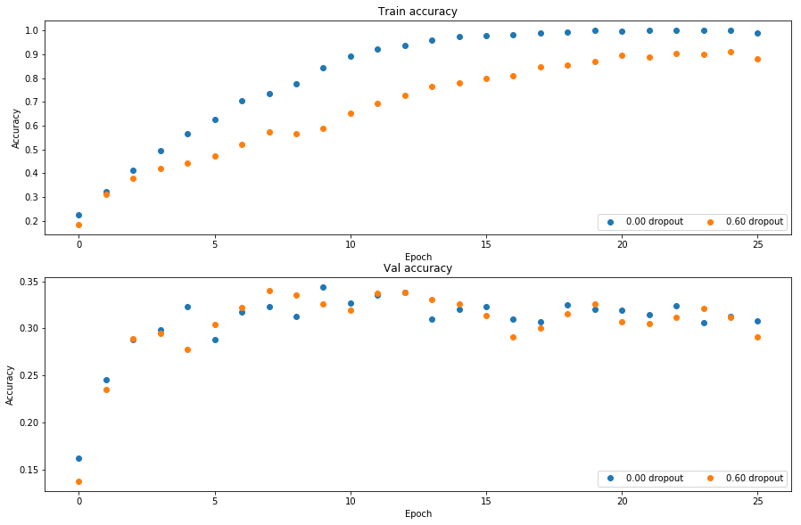

# Dropout

In this notebook, you will implement dropout.  Then we will ask you to train a network with batchnorm and dropout, and acheive over 60% accuracy on CIFAR-10.

CS231n has built a solid API for building these modular frameworks and training them, and we will use their very well implemented framework as opposed to "reinventing the wheel."  This includes using their Solver, various utility functions, and their layer structure.  This also includes nndl.fc_net, nndl.layers, and nndl.layer_utils.  As in prior assignments, we thank Serena Yeung & Justin Johnson for permission to use code written for the CS 231n class (cs231n.stanford.edu).  


```python
## Import and setups

import time
import numpy as np
import matplotlib.pyplot as plt
from nndl.fc_net import *
from nndl.layers import *
from cs231n.data_utils import get_CIFAR10_data
from cs231n.gradient_check import eval_numerical_gradient, eval_numerical_gradient_array
from cs231n.solver import Solver

%matplotlib inline
plt.rcParams['figure.figsize'] = (10.0, 8.0) # set default size of plots
plt.rcParams['image.interpolation'] = 'nearest'
plt.rcParams['image.cmap'] = 'gray'

# for auto-reloading external modules
# see http://stackoverflow.com/questions/1907993/autoreload-of-modules-in-ipython
%load_ext autoreload
%autoreload 2

def rel_error(x, y):
  """ returns relative error """
  return np.max(np.abs(x - y) / (np.maximum(1e-8, np.abs(x) + np.abs(y))))
```


```python
# Load the (preprocessed) CIFAR10 data.

data = get_CIFAR10_data()
for k in data.keys():
  print('{}: {} '.format(k, data[k].shape))
```

    y_train: (49000,) 
    y_val: (1000,) 
    X_train: (49000, 3, 32, 32) 
    X_test: (1000, 3, 32, 32) 
    X_val: (1000, 3, 32, 32) 
    y_test: (1000,) 


## Dropout forward pass

Implement the training and test time dropout forward pass, `dropout_forward`, in `nndl/layers.py`. After that, test your implementation by running the following cell.


```python
x = np.random.randn(500, 500) + 10

for p in [0.3, 0.6, 0.75]:
  out, _ = dropout_forward(x, {'mode': 'train', 'p': p})
  out_test, _ = dropout_forward(x, {'mode': 'test', 'p': p})

  print('Running tests with p = ', p)
  print('Mean of input: ', x.mean())
  print('Mean of train-time output: ', out.mean())
  print('Mean of test-time output: ', out_test.mean())
  print('Fraction of train-time output set to zero: ', (out == 0).mean())
  print('Fraction of test-time output set to zero: ', (out_test == 0).mean())
```

    Running tests with p =  0.3
    Mean of input:  10.0008759413
    Mean of train-time output:  10.0030855725
    Mean of test-time output:  10.0008759413
    Fraction of train-time output set to zero:  0.699928
    Fraction of test-time output set to zero:  0.0
    Running tests with p =  0.6
    Mean of input:  10.0008759413
    Mean of train-time output:  10.0037548853
    Mean of test-time output:  10.0008759413
    Fraction of train-time output set to zero:  0.399816
    Fraction of test-time output set to zero:  0.0
    Running tests with p =  0.75
    Mean of input:  10.0008759413
    Mean of train-time output:  10.0124150442
    Mean of test-time output:  10.0008759413
    Fraction of train-time output set to zero:  0.24922
    Fraction of test-time output set to zero:  0.0


## Dropout backward pass

Implement the backward pass, `dropout_backward`, in `nndl/layers.py`.  After that, test your gradients by running the following cell:


```python
x = np.random.randn(10, 10) + 10
dout = np.random.randn(*x.shape)

dropout_param = {'mode': 'train', 'p': 0.8, 'seed': 123}
out, cache = dropout_forward(x, dropout_param)
dx = dropout_backward(dout, cache)
dx_num = eval_numerical_gradient_array(lambda xx: dropout_forward(xx, dropout_param)[0], x, dout)

print('dx relative error: ', rel_error(dx, dx_num))
```

    dx relative error:  5.44560904071e-11


## Implement a fully connected neural network with dropout layers

Modify the `FullyConnectedNet()` class in `nndl/fc_net.py` to incorporate dropout.  A dropout layer should be incorporated after every ReLU layer.  Concretely, there shouldn't be a dropout at the output layer since there is no ReLU at the output layer. You will need to modify the class in the following areas:

(1) In the forward pass, you will need to incorporate a dropout layer after every relu layer.

(2) In the backward pass, you will need to incorporate a dropout backward pass layer.

Check your implementation by running the following code.  Our W1 gradient relative error is on the order of 1e-6 (the largest of all the relative errors).


```python
N, D, H1, H2, C = 2, 15, 20, 30, 10
X = np.random.randn(N, D)
y = np.random.randint(C, size=(N,))

for dropout in [0, 0.25, 0.5]:
  print('Running check with dropout = ', dropout)
  model = FullyConnectedNet([H1, H2], input_dim=D, num_classes=C,
                            weight_scale=5e-2, dtype=np.float64,
                            dropout=dropout, seed=123)

  loss, grads = model.loss(X, y)
  print('Initial loss: ', loss)

  for name in sorted(grads):
    f = lambda _: model.loss(X, y)[0]
    grad_num = eval_numerical_gradient(f, model.params[name], verbose=False, h=1e-5)
    print('{} relative error: {}'.format(name, rel_error(grad_num, grads[name])))
  print('\n')
```

    Running check with dropout =  0
    Initial loss:  2.31418234444
    W1 relative error: 3.152163618051263e-08
    W2 relative error: 1.696950190217807e-08
    b1 relative error: 1.9872671943271133e-09
    b2 relative error: 1.5649442082126447e-10
    
    
    Running check with dropout =  0.25
    Initial loss:  2.31535237536
    W1 relative error: 6.9892606168965885e-09
    W2 relative error: 3.102857679581115e-10
    b1 relative error: 3.8162549597911735e-10
    b2 relative error: 1.0709568129602027e-10
    
    
    Running check with dropout =  0.5
    Initial loss:  2.3055719127
    W1 relative error: 1.2303069007747731e-08
    W2 relative error: 2.2394060721635313e-09
    b1 relative error: 1.1833771783525315e-08
    b2 relative error: 1.710237953855547e-10
    
    


## Dropout as a regularizer

In class, we claimed that dropout acts as a regularizer by effectively bagging.  To check this, we will train two small networks, one with dropout and one without dropout.  


```python
# Train two identical nets, one with dropout and one without

num_train = 500
small_data = {
  'X_train': data['X_train'][:num_train],
  'y_train': data['y_train'][:num_train],
  'X_val': data['X_val'],
  'y_val': data['y_val'],
}

solvers = {}
dropout_choices = [0, 0.6]
for dropout in dropout_choices:
  model = FullyConnectedNet([100, 100, 100], dropout=dropout)

  solver = Solver(model, small_data,
                  num_epochs=25, batch_size=100,
                  update_rule='adam',
                  optim_config={
                    'learning_rate': 5e-4,
                  },
                  verbose=True, print_every=100)
  solver.train()
  solvers[dropout] = solver
```

    (Iteration 1 / 125) loss: 2.332522
    (Epoch 0 / 25) train acc: 0.224000; val_acc: 0.162000
    (Epoch 1 / 25) train acc: 0.322000; val_acc: 0.246000
    (Epoch 2 / 25) train acc: 0.414000; val_acc: 0.288000
    (Epoch 3 / 25) train acc: 0.494000; val_acc: 0.299000
    (Epoch 4 / 25) train acc: 0.566000; val_acc: 0.323000
    (Epoch 5 / 25) train acc: 0.626000; val_acc: 0.288000
    (Epoch 6 / 25) train acc: 0.704000; val_acc: 0.317000
    (Epoch 7 / 25) train acc: 0.734000; val_acc: 0.323000
    (Epoch 8 / 25) train acc: 0.776000; val_acc: 0.313000
    (Epoch 9 / 25) train acc: 0.844000; val_acc: 0.344000
    (Epoch 10 / 25) train acc: 0.890000; val_acc: 0.327000
    (Epoch 11 / 25) train acc: 0.920000; val_acc: 0.335000
    (Epoch 12 / 25) train acc: 0.938000; val_acc: 0.338000
    (Epoch 13 / 25) train acc: 0.960000; val_acc: 0.310000
    (Epoch 14 / 25) train acc: 0.974000; val_acc: 0.320000
    (Epoch 15 / 25) train acc: 0.978000; val_acc: 0.323000
    (Epoch 16 / 25) train acc: 0.980000; val_acc: 0.310000
    (Epoch 17 / 25) train acc: 0.990000; val_acc: 0.307000
    (Epoch 18 / 25) train acc: 0.994000; val_acc: 0.325000
    (Epoch 19 / 25) train acc: 1.000000; val_acc: 0.320000
    (Epoch 20 / 25) train acc: 0.996000; val_acc: 0.319000
    (Iteration 101 / 125) loss: 0.029197
    (Epoch 21 / 25) train acc: 1.000000; val_acc: 0.315000
    (Epoch 22 / 25) train acc: 1.000000; val_acc: 0.324000
    (Epoch 23 / 25) train acc: 1.000000; val_acc: 0.306000
    (Epoch 24 / 25) train acc: 1.000000; val_acc: 0.313000
    (Epoch 25 / 25) train acc: 0.990000; val_acc: 0.308000
    (Iteration 1 / 125) loss: 2.335937
    (Epoch 0 / 25) train acc: 0.184000; val_acc: 0.138000
    (Epoch 1 / 25) train acc: 0.312000; val_acc: 0.235000
    (Epoch 2 / 25) train acc: 0.378000; val_acc: 0.289000
    (Epoch 3 / 25) train acc: 0.422000; val_acc: 0.295000
    (Epoch 4 / 25) train acc: 0.442000; val_acc: 0.278000
    (Epoch 5 / 25) train acc: 0.474000; val_acc: 0.304000
    (Epoch 6 / 25) train acc: 0.522000; val_acc: 0.322000
    (Epoch 7 / 25) train acc: 0.572000; val_acc: 0.340000
    (Epoch 8 / 25) train acc: 0.568000; val_acc: 0.335000
    (Epoch 9 / 25) train acc: 0.590000; val_acc: 0.326000
    (Epoch 10 / 25) train acc: 0.652000; val_acc: 0.319000
    (Epoch 11 / 25) train acc: 0.694000; val_acc: 0.337000
    (Epoch 12 / 25) train acc: 0.726000; val_acc: 0.338000
    (Epoch 13 / 25) train acc: 0.766000; val_acc: 0.331000
    (Epoch 14 / 25) train acc: 0.780000; val_acc: 0.326000
    (Epoch 15 / 25) train acc: 0.798000; val_acc: 0.314000
    (Epoch 16 / 25) train acc: 0.810000; val_acc: 0.291000
    (Epoch 17 / 25) train acc: 0.846000; val_acc: 0.300000
    (Epoch 18 / 25) train acc: 0.856000; val_acc: 0.316000
    (Epoch 19 / 25) train acc: 0.870000; val_acc: 0.326000
    (Epoch 20 / 25) train acc: 0.896000; val_acc: 0.307000
    (Iteration 101 / 125) loss: 0.839085
    (Epoch 21 / 25) train acc: 0.888000; val_acc: 0.305000
    (Epoch 22 / 25) train acc: 0.904000; val_acc: 0.312000
    (Epoch 23 / 25) train acc: 0.900000; val_acc: 0.321000
    (Epoch 24 / 25) train acc: 0.910000; val_acc: 0.312000
    (Epoch 25 / 25) train acc: 0.882000; val_acc: 0.291000


```python
# Plot train and validation accuracies of the two models

train_accs = []
val_accs = []
for dropout in dropout_choices:
  solver = solvers[dropout]
  train_accs.append(solver.train_acc_history[-1])
  val_accs.append(solver.val_acc_history[-1])

plt.subplot(3, 1, 1)
for dropout in dropout_choices:
  plt.plot(solvers[dropout].train_acc_history, 'o', label='%.2f dropout' % dropout)
plt.title('Train accuracy')
plt.xlabel('Epoch')
plt.ylabel('Accuracy')
plt.legend(ncol=2, loc='lower right')
  
plt.subplot(3, 1, 2)
for dropout in dropout_choices:
  plt.plot(solvers[dropout].val_acc_history, 'o', label='%.2f dropout' % dropout)
plt.title('Val accuracy')
plt.xlabel('Epoch')
plt.ylabel('Accuracy')
plt.legend(ncol=2, loc='lower right')

plt.gcf().set_size_inches(15, 15)
plt.show()
```





## Question

Based off the results of this experiment, is dropout performing regularization?  Explain your answer.

## Answer:

Yes, dropout is performing regularizaiton based on the experiment. In class and in the book, we gave a broad definition of regularization as anything that is done to improve the generalization accuracy (in this case estiamted by the validation accuracy), at a possible cost to the training accuracy. Here, we can see that we had slightly reduced training accuracy but did better on the validation dataset using dropout. 

## Final part of the assignment

Get over 60% validation accuracy on CIFAR-10 by using the layers you have implemented.  You will be graded according to the following equation:

min(floor((X - 32%)) / 28%, 1) 
where if you get 60% or higher validation accuracy, you get full points.


```python
#================================================================ #
# YOUR CODE HERE:
#   Implement a FC-net that achieves at least 60% validation accuracy
#   on CIFAR-10.
# ================================================================ #

# so in order to do this, I started off with a broad hyperparameter search and figured out where I got close to 60.
# then I fine tuned the hyperparams in that area

# my main idea was to have a deep, large network so it has high expressivity
# but control overfitting with a large dropout.
# batchnorm, learning rate decay, and the adam optimizer also helped.

# the below were the hyperparams I ended up with.
#HYPERPARAMETERS USED
# 4 hidden layers of 500 units each, 0.75 dropout, batch size of 100, lr = 1e-3, decay = 0.9, weight_scale = 0.01
# note: i stopped the network earlybecause it didn't seem to be getting any better, got a val acc of 0.586
np.random.seed(1234)
solvers = {}
dropout = 0.75
batch_size = 100
learning_rate = 1e-3 #1e-3
hidden_layer_size = 500
lr_decay = 0.9
best_val_acc, best_solver = 0.0, None
model = FullyConnectedNet([hidden_layer_size, hidden_layer_size, hidden_layer_size], dropout = dropout, weight_scale = 0.01, use_batchnorm=True)
solver = Solver(model, data, num_epochs = 25, batch_size = batch_size, update_rule = 'adam', optim_config = { 'learning_rate': learning_rate,}, lr_decay = lr_decay, verbose = True, print_every = 100)
solver.train()
print('done training. Got a test accuracy of {} and a validation accuracy of {}'.format(solver.train_acc_history[-1], solver.val_acc_history[-1]))
if solver.val_acc_history[-1] > best_val_acc:
    best_val_acc = solver.val_acc_history[-1]
    best_solver = solver
    
# ================== #
# END YOUR CODE HERE
# ================================================================ #

```

    (Iteration 1 / 12250) loss: 2.280825
    (Epoch 0 / 25) train acc: 0.195000; val_acc: 0.203000
    (Iteration 101 / 12250) loss: 1.712041
    (Iteration 201 / 12250) loss: 1.624767
    (Iteration 301 / 12250) loss: 1.516743
    (Iteration 401 / 12250) loss: 1.545157
    (Epoch 1 / 25) train acc: 0.494000; val_acc: 0.467000
    (Iteration 501 / 12250) loss: 1.550509
    (Iteration 601 / 12250) loss: 1.507818
    (Iteration 701 / 12250) loss: 1.295949
    (Iteration 801 / 12250) loss: 1.455602
    (Iteration 901 / 12250) loss: 1.297721
    (Epoch 2 / 25) train acc: 0.532000; val_acc: 0.515000
    (Iteration 1001 / 12250) loss: 1.332914
    (Iteration 1101 / 12250) loss: 1.386130
    (Iteration 1201 / 12250) loss: 1.517584
    (Iteration 1301 / 12250) loss: 1.081766
    (Iteration 1401 / 12250) loss: 1.173483
    (Epoch 3 / 25) train acc: 0.585000; val_acc: 0.543000
    (Iteration 1501 / 12250) loss: 1.110842
    (Iteration 1601 / 12250) loss: 1.409498
    (Iteration 1701 / 12250) loss: 1.234978
    (Iteration 1801 / 12250) loss: 1.232522
    (Iteration 1901 / 12250) loss: 1.189248
    (Epoch 4 / 25) train acc: 0.592000; val_acc: 0.542000
    (Iteration 2001 / 12250) loss: 1.153092
    (Iteration 2101 / 12250) loss: 1.171023
    (Iteration 2201 / 12250) loss: 1.049760
    (Iteration 2301 / 12250) loss: 1.067445
    (Iteration 2401 / 12250) loss: 1.341731
    (Epoch 5 / 25) train acc: 0.631000; val_acc: 0.550000
    (Iteration 2501 / 12250) loss: 1.234808
    (Iteration 2601 / 12250) loss: 1.106125
    (Iteration 2701 / 12250) loss: 1.106153
    (Iteration 2801 / 12250) loss: 1.124826
    (Iteration 2901 / 12250) loss: 1.311329
    (Epoch 6 / 25) train acc: 0.612000; val_acc: 0.562000
    (Iteration 3001 / 12250) loss: 1.344609
    (Iteration 3101 / 12250) loss: 1.090185
    (Iteration 3201 / 12250) loss: 1.056797
    (Iteration 3301 / 12250) loss: 1.040333
    (Iteration 3401 / 12250) loss: 1.009323
    (Epoch 7 / 25) train acc: 0.640000; val_acc: 0.560000
    (Iteration 3501 / 12250) loss: 1.076566
    (Iteration 3601 / 12250) loss: 1.077023
    (Iteration 3701 / 12250) loss: 0.870094
    (Iteration 3801 / 12250) loss: 1.024979
    (Iteration 3901 / 12250) loss: 1.107719
    (Epoch 8 / 25) train acc: 0.669000; val_acc: 0.576000
    (Iteration 4001 / 12250) loss: 1.150855
    (Iteration 4101 / 12250) loss: 0.950336
    (Iteration 4201 / 12250) loss: 0.755787
    (Iteration 4301 / 12250) loss: 1.062732
    (Iteration 4401 / 12250) loss: 0.720832
    (Epoch 9 / 25) train acc: 0.707000; val_acc: 0.583000
    (Iteration 4501 / 12250) loss: 0.960566
    (Iteration 4601 / 12250) loss: 0.969052
    (Iteration 4701 / 12250) loss: 0.987831
    (Iteration 4801 / 12250) loss: 1.122046
    (Epoch 10 / 25) train acc: 0.706000; val_acc: 0.577000
    (Iteration 4901 / 12250) loss: 1.081653
    (Iteration 5001 / 12250) loss: 1.221751
    (Iteration 5101 / 12250) loss: 0.999472
    (Iteration 5201 / 12250) loss: 0.983912
    (Iteration 5301 / 12250) loss: 0.976316
    (Epoch 11 / 25) train acc: 0.732000; val_acc: 0.585000
    (Iteration 5401 / 12250) loss: 0.891815
    (Iteration 5501 / 12250) loss: 1.124777
    (Iteration 5601 / 12250) loss: 0.900645
    (Iteration 5701 / 12250) loss: 0.787867
    (Iteration 5801 / 12250) loss: 0.861920
    (Epoch 12 / 25) train acc: 0.761000; val_acc: 0.581000
    (Iteration 5901 / 12250) loss: 1.034995
    (Iteration 6001 / 12250) loss: 0.874077
    (Iteration 6101 / 12250) loss: 1.067351
    (Iteration 6201 / 12250) loss: 0.767496
    (Iteration 6301 / 12250) loss: 1.023306
    (Epoch 13 / 25) train acc: 0.743000; val_acc: 0.579000
    (Iteration 6401 / 12250) loss: 1.023623
    (Iteration 6501 / 12250) loss: 0.985254
    (Iteration 6601 / 12250) loss: 0.976035
    (Iteration 6701 / 12250) loss: 0.959728
    (Iteration 6801 / 12250) loss: 0.886309
    (Epoch 14 / 25) train acc: 0.759000; val_acc: 0.579000
    (Iteration 6901 / 12250) loss: 0.735149
    (Iteration 7001 / 12250) loss: 0.763289
    (Iteration 7101 / 12250) loss: 0.855879
    (Iteration 7201 / 12250) loss: 0.786694
    (Iteration 7301 / 12250) loss: 0.947139
    (Epoch 15 / 25) train acc: 0.784000; val_acc: 0.575000
    (Iteration 7401 / 12250) loss: 0.649316
    (Iteration 7501 / 12250) loss: 0.659297
    (Iteration 7601 / 12250) loss: 0.687769
    (Iteration 7701 / 12250) loss: 0.880348
    (Iteration 7801 / 12250) loss: 0.792361
    (Epoch 16 / 25) train acc: 0.784000; val_acc: 0.580000
    (Iteration 7901 / 12250) loss: 0.771384
    (Iteration 8001 / 12250) loss: 0.765989
    (Iteration 8101 / 12250) loss: 1.109019
    (Iteration 8201 / 12250) loss: 0.757826
    (Iteration 8301 / 12250) loss: 0.851621
    (Epoch 17 / 25) train acc: 0.774000; val_acc: 0.590000
    (Iteration 8401 / 12250) loss: 0.922324
    (Iteration 8501 / 12250) loss: 0.770878
    (Iteration 8601 / 12250) loss: 0.735701
    (Iteration 8701 / 12250) loss: 0.908540
    (Iteration 8801 / 12250) loss: 0.712543
    (Epoch 18 / 25) train acc: 0.797000; val_acc: 0.570000
    (Iteration 8901 / 12250) loss: 0.759616
    (Iteration 9001 / 12250) loss: 0.673351
    (Iteration 9101 / 12250) loss: 0.827055
    (Iteration 9201 / 12250) loss: 0.679886
    (Iteration 9301 / 12250) loss: 0.820736
    (Epoch 19 / 25) train acc: 0.821000; val_acc: 0.579000
    (Iteration 9401 / 12250) loss: 0.789260
    (Iteration 9501 / 12250) loss: 0.811642
    (Iteration 9601 / 12250) loss: 0.631809
    (Iteration 9701 / 12250) loss: 0.784253
    (Epoch 20 / 25) train acc: 0.810000; val_acc: 0.579000
    (Iteration 9801 / 12250) loss: 0.851510
    (Iteration 9901 / 12250) loss: 1.019607
    (Iteration 10001 / 12250) loss: 0.646361
    (Iteration 10101 / 12250) loss: 0.711297
    (Iteration 10201 / 12250) loss: 0.852993
    (Epoch 21 / 25) train acc: 0.827000; val_acc: 0.573000
    (Iteration 10301 / 12250) loss: 0.664814
    (Iteration 10401 / 12250) loss: 0.782403
    (Iteration 10501 / 12250) loss: 0.952000
    (Iteration 10601 / 12250) loss: 0.760245
    (Iteration 10701 / 12250) loss: 0.626124
    (Epoch 22 / 25) train acc: 0.836000; val_acc: 0.568000
    (Iteration 10801 / 12250) loss: 0.777344
    (Iteration 10901 / 12250) loss: 0.734849
    (Iteration 11001 / 12250) loss: 0.786324
    (Iteration 11101 / 12250) loss: 0.772074
    (Iteration 11201 / 12250) loss: 0.591579
    (Epoch 23 / 25) train acc: 0.849000; val_acc: 0.586000
    (Iteration 11301 / 12250) loss: 0.792573
    (Iteration 11401 / 12250) loss: 0.783674


```python

```
