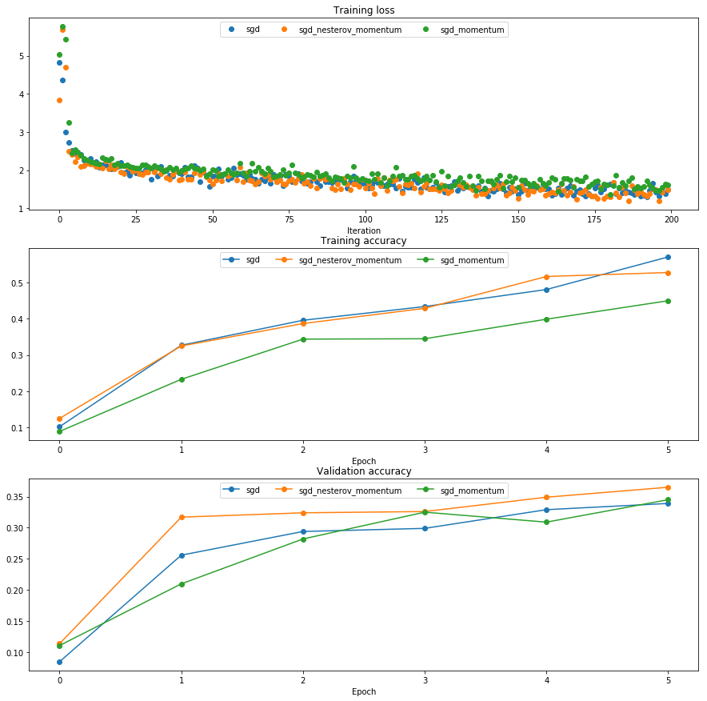
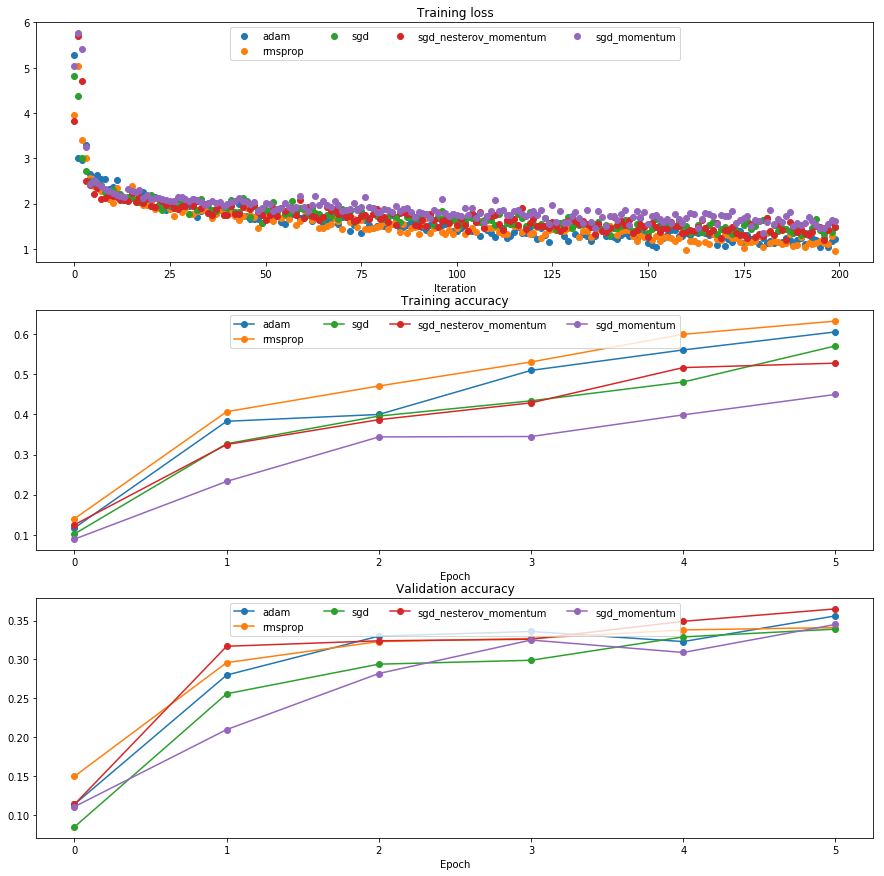

## Optimization for Fully Connected Networks

In this notebook, we will implement different optimization rules for gradient descent.  We have provided starter code; however, you will need to copy and paste your code from your implementation of the modular fully connected nets in HW #3 to build upon this.

If you did not complete `affine` forward and backwards passes, or `relu` forward and backward passes from HW #3 correctly, you may use another classmate's implementation of these functions for this assignment, or contact us at ece239as.w18@gmail.com.

CS231n has built a solid API for building these modular frameworks and training them, and we will use their very well implemented framework as opposed to "reinventing the wheel."  This includes using their Solver, various utility functions, and their layer structure.  This also includes nndl.fc_net, nndl.layers, and nndl.layer_utils.  As in prior assignments, we thank Serena Yeung & Justin Johnson for permission to use code written for the CS 231n class (cs231n.stanford.edu).  


```python
## Import and setups

import time
import numpy as np
import matplotlib.pyplot as plt
from nndl.fc_net import *
from cs231n.data_utils import get_CIFAR10_data
from cs231n.gradient_check import eval_numerical_gradient, eval_numerical_gradient_array
from cs231n.solver import Solver

%matplotlib inline
plt.rcParams['figure.figsize'] = (10.0, 8.0) # set default size of plots
plt.rcParams['image.interpolation'] = 'nearest'
plt.rcParams['image.cmap'] = 'gray'

# for auto-reloading external modules
# see http://stackoverflow.com/questions/1907993/autoreload-of-modules-in-ipython
%load_ext autoreload
%autoreload 2

def rel_error(x, y):
  """ returns relative error """
  return np.max(np.abs(x - y) / (np.maximum(1e-8, np.abs(x) + np.abs(y))))
```


```python
# Load the (preprocessed) CIFAR10 data.

data = get_CIFAR10_data()
for k in data.keys():
  print('{}: {} '.format(k, data[k].shape))
```

    y_test: (1000,) 
    y_val: (1000,) 
    y_train: (49000,) 
    X_test: (1000, 3, 32, 32) 
    X_val: (1000, 3, 32, 32) 
    X_train: (49000, 3, 32, 32) 


## Building upon your HW #3 implementation

Copy and paste the following functions from your HW #3 implementation of a modular FC net:

- `affine_forward` in `nndl/layers.py`
- `affine_backward` in `nndl/layers.py`
- `relu_forward` in `nndl/layers.py`
- `relu_backward` in `nndl/layers.py`
- `affine_relu_forward` in ``nndl/layer_utils.py``
- `affine_relu_backward` in ``nndl/layer_utils.py``
- The `FullyConnectedNet` class in `nndl/fc_net.py`

### Test all functions you copy and pasted


```python
from nndl.layer_tests import *

affine_forward_test(); print('\n')
affine_backward_test(); print('\n')
relu_forward_test(); print('\n')
relu_backward_test(); print('\n')
affine_relu_test(); print('\n')
fc_net_test()
```

    If affine_forward function is working, difference should be less than 1e-9:
    difference: 9.7698500479884e-10
    
    
    If affine_backward is working, error should be less than 1e-9::
    dx error: 3.425174948831052e-09
    dw error: 2.0181150167846598e-10
    db error: 2.71112290342241e-11
    
    
    If relu_forward function is working, difference should be around 1e-8:
    difference: 4.999999798022158e-08
    
    
    If relu_forward function is working, error should be less than 1e-9:
    dx error: 3.2756030353717306e-12
    
    
    If affine_relu_forward and affine_relu_backward are working, error should be less than 1e-9::
    dx error: 8.208331151078784e-11
    dw error: 2.2047301406296422e-10
    db error: 7.342802713872311e-12
    
    
    Running check with reg = 0
    Initial loss: 2.3187009401241014
    W1 relative error: 1.5676258703601608e-07
    W2 relative error: 1.4036199640586682e-08
    b1 relative error: 5.513475865025559e-09
    b2 relative error: 1.2167338006798878e-10
    Running check with reg = 3.14
    Initial loss: 4.350864899231536
    W1 relative error: 2.1862441665380755e-08
    W2 relative error: 1.0111853568291268e-08
    b1 relative error: 1.3781343684885996e-07
    b2 relative error: 2.4762748288076706e-10


# Training a larger model

In general, proceeding with vanilla stochastic gradient descent to optimize models may be fraught with problems and limitations, as discussed in class.  Thus, we implement optimizers that improve on SGD.

## SGD + momentum

In the following section, implement SGD with momentum.  Read the `nndl/optim.py` API, which is provided by CS231n, and be sure you understand it.  After, implement `sgd_momentum` in `nndl/optim.py`.  Test your implementation of `sgd_momentum` by running the cell below.


```python
from nndl.optim import sgd_momentum

N, D = 4, 5
w = np.linspace(-0.4, 0.6, num=N*D).reshape(N, D)
dw = np.linspace(-0.6, 0.4, num=N*D).reshape(N, D)
v = np.linspace(0.6, 0.9, num=N*D).reshape(N, D)

config = {'learning_rate': 1e-3, 'velocity': v}
next_w, _ = sgd_momentum(w, dw, config=config)

expected_next_w = np.asarray([
  [ 0.1406,      0.20738947,  0.27417895,  0.34096842,  0.40775789],
  [ 0.47454737,  0.54133684,  0.60812632,  0.67491579,  0.74170526],
  [ 0.80849474,  0.87528421,  0.94207368,  1.00886316,  1.07565263],
  [ 1.14244211,  1.20923158,  1.27602105,  1.34281053,  1.4096    ]])
expected_velocity = np.asarray([
  [ 0.5406,      0.55475789,  0.56891579, 0.58307368,  0.59723158],
  [ 0.61138947,  0.62554737,  0.63970526,  0.65386316,  0.66802105],
  [ 0.68217895,  0.69633684,  0.71049474,  0.72465263,  0.73881053],
  [ 0.75296842,  0.76712632,  0.78128421,  0.79544211,  0.8096    ]])

print('next_w error: {}'.format(rel_error(next_w, expected_next_w)))
print('velocity error: {}'.format(rel_error(expected_velocity, config['velocity'])))
```

    next_w error: 8.882347033505819e-09
    velocity error: 4.269287743278663e-09


## SGD + Nesterov momentum
Implement `sgd_nesterov_momentum` in `ndl/optim.py`.


```python
from nndl.optim import sgd_nesterov_momentum

N, D = 4, 5
w = np.linspace(-0.4, 0.6, num=N*D).reshape(N, D)
dw = np.linspace(-0.6, 0.4, num=N*D).reshape(N, D)
v = np.linspace(0.6, 0.9, num=N*D).reshape(N, D)

config = {'learning_rate': 1e-3, 'velocity': v}
next_w, _ = sgd_nesterov_momentum(w, dw, config=config)

expected_next_w = np.asarray([
  [0.08714,      0.15246105,  0.21778211,  0.28310316,  0.34842421],
  [0.41374526,   0.47906632,  0.54438737,  0.60970842,  0.67502947],
  [0.74035053,   0.80567158,  0.87099263,  0.93631368,  1.00163474],
  [1.06695579,   1.13227684,  1.19759789,  1.26291895,  1.32824   ]])
expected_velocity = np.asarray([
  [ 0.5406,      0.55475789,  0.56891579,  0.58307368,  0.59723158],
  [ 0.61138947,  0.62554737,  0.63970526,  0.65386316,  0.66802105],
  [ 0.68217895,  0.69633684,  0.71049474,  0.72465263,  0.73881053],
  [ 0.75296842,  0.76712632,  0.78128421,  0.79544211,  0.8096    ]])

print('next_w error: {}'.format(rel_error(next_w, expected_next_w)))
print('velocity error: {}'.format(rel_error(expected_velocity, config['velocity'])))
```

    next_w error: 1.0875186845081027e-08
    velocity error: 4.269287743278663e-09


## Evaluating SGD, SGD+Momentum, and SGD+NesterovMomentum

Run the following cell to train a 6 layer FC net with SGD, SGD+momentum, and SGD+Nesterov momentum.  You should see that SGD+momentum achieves a better loss than SGD, and that SGD+Nesterov momentum achieves a slightly better loss (and training accuracy) than SGD+momentum.


```python
num_train = 4000
small_data = {
  'X_train': data['X_train'][:num_train],
  'y_train': data['y_train'][:num_train],
  'X_val': data['X_val'],
  'y_val': data['y_val'],
}

solvers = {}

for update_rule in ['sgd', 'sgd_momentum', 'sgd_nesterov_momentum']:
  print('Optimizing with {}'.format(update_rule))
  model = FullyConnectedNet([100, 100, 100, 100, 100], weight_scale=5e-2)

  solver = Solver(model, small_data,
                  num_epochs=5, batch_size=100,
                  update_rule=update_rule,
                  optim_config={
                    'learning_rate': 1e-2,
                  },
                  verbose=False)
  solvers[update_rule] = solver
  solver.train()
  print

plt.subplot(3, 1, 1)
plt.title('Training loss')
plt.xlabel('Iteration')

plt.subplot(3, 1, 2)
plt.title('Training accuracy')
plt.xlabel('Epoch')

plt.subplot(3, 1, 3)
plt.title('Validation accuracy')
plt.xlabel('Epoch')

for update_rule, solver in solvers.items():
  plt.subplot(3, 1, 1)
  plt.plot(solver.loss_history, 'o', label=update_rule)
  
  plt.subplot(3, 1, 2)
  plt.plot(solver.train_acc_history, '-o', label=update_rule)

  plt.subplot(3, 1, 3)
  plt.plot(solver.val_acc_history, '-o', label=update_rule)
  
for i in [1, 2, 3]:
  plt.subplot(3, 1, i)
  plt.legend(loc='upper center', ncol=4)
plt.gcf().set_size_inches(15, 15)
plt.show()
```

    Optimizing with sgd
    Optimizing with sgd_momentum
    Optimizing with sgd_nesterov_momentum





## RMSProp

Now we go to techniques that adapt the gradient.  Implement `rmsprop` in `nndl/optim.py`.  Test your implementation by running the cell below.


```python
from nndl.optim import rmsprop

N, D = 4, 5
w = np.linspace(-0.4, 0.6, num=N*D).reshape(N, D)
dw = np.linspace(-0.6, 0.4, num=N*D).reshape(N, D)
a = np.linspace(0.6, 0.9, num=N*D).reshape(N, D)

config = {'learning_rate': 1e-2, 'a': a}
next_w, _ = rmsprop(w, dw, config=config)

expected_next_w = np.asarray([
  [-0.39223849, -0.34037513, -0.28849239, -0.23659121, -0.18467247],
  [-0.132737,   -0.08078555, -0.02881884,  0.02316247,  0.07515774],
  [ 0.12716641,  0.17918792,  0.23122175,  0.28326742,  0.33532447],
  [ 0.38739248,  0.43947102,  0.49155973,  0.54365823,  0.59576619]])
expected_cache = np.asarray([
  [ 0.5976,      0.6126277,   0.6277108,   0.64284931,  0.65804321],
  [ 0.67329252,  0.68859723,  0.70395734,  0.71937285,  0.73484377],
  [ 0.75037008,  0.7659518,   0.78158892,  0.79728144,  0.81302936],
  [ 0.82883269,  0.84469141,  0.86060554,  0.87657507,  0.8926    ]])

print('next_w error: {}'.format(rel_error(expected_next_w, next_w)))
print('cache error: {}'.format(rel_error(expected_cache, config['a'])))
```

    next_w error: 9.524687511038133e-08
    cache error: 2.6477955807156126e-09


## Adaptive moments

Now, implement `adam` in `nndl/optim.py`.  Test your implementation by running the cell below.


```python
# Test Adam implementation; you should see errors around 1e-7 or less
from nndl.optim import adam

N, D = 4, 5
w = np.linspace(-0.4, 0.6, num=N*D).reshape(N, D)
dw = np.linspace(-0.6, 0.4, num=N*D).reshape(N, D)
v = np.linspace(0.6, 0.9, num=N*D).reshape(N, D)
a = np.linspace(0.7, 0.5, num=N*D).reshape(N, D)

config = {'learning_rate': 1e-2, 'v': v, 'a': a, 't': 5}
next_w, _ = adam(w, dw, config=config)

expected_next_w = np.asarray([
  [-0.40094747, -0.34836187, -0.29577703, -0.24319299, -0.19060977],
  [-0.1380274,  -0.08544591, -0.03286534,  0.01971428,  0.0722929],
  [ 0.1248705,   0.17744702,  0.23002243,  0.28259667,  0.33516969],
  [ 0.38774145,  0.44031188,  0.49288093,  0.54544852,  0.59801459]])
expected_a = np.asarray([
  [ 0.69966,     0.68908382,  0.67851319,  0.66794809,  0.65738853,],
  [ 0.64683452,  0.63628604,  0.6257431,   0.61520571,  0.60467385,],
  [ 0.59414753,  0.58362676,  0.57311152,  0.56260183,  0.55209767,],
  [ 0.54159906,  0.53110598,  0.52061845,  0.51013645,  0.49966,   ]])
expected_v = np.asarray([
  [ 0.48,        0.49947368,  0.51894737,  0.53842105,  0.55789474],
  [ 0.57736842,  0.59684211,  0.61631579,  0.63578947,  0.65526316],
  [ 0.67473684,  0.69421053,  0.71368421,  0.73315789,  0.75263158],
  [ 0.77210526,  0.79157895,  0.81105263,  0.83052632,  0.85      ]])

print('next_w error: {}'.format(rel_error(expected_next_w, next_w)))
print('a error: {}'.format(rel_error(expected_a, config['a'])))
print('v error: {}'.format(rel_error(expected_v, config['v'])))
```

    next_w error: 1.1395691798535431e-07
    a error: 4.208314038113071e-09
    v error: 4.214963193114416e-09


## Comparing SGD, SGD+NesterovMomentum, RMSProp, and Adam

The following code will compare optimization with SGD, Momentum, Nesterov Momentum, RMSProp and Adam.  In our code, we find that RMSProp, Adam, and SGD + Nesterov Momentum achieve approximately the same training error after a few training epochs.


```python
learning_rates = {'rmsprop': 2e-4, 'adam': 1e-3}

for update_rule in ['adam', 'rmsprop']:
  print('Optimizing with {}'.format(update_rule))
  model = FullyConnectedNet([100, 100, 100, 100, 100], weight_scale=5e-2)

  solver = Solver(model, small_data,
                  num_epochs=5, batch_size=100,
                  update_rule=update_rule,
                  optim_config={
                    'learning_rate': learning_rates[update_rule]
                  },
                  verbose=False)
  solvers[update_rule] = solver
  solver.train()
  print

plt.subplot(3, 1, 1)
plt.title('Training loss')
plt.xlabel('Iteration')

plt.subplot(3, 1, 2)
plt.title('Training accuracy')
plt.xlabel('Epoch')

plt.subplot(3, 1, 3)
plt.title('Validation accuracy')
plt.xlabel('Epoch')

for update_rule, solver in solvers.items():
  plt.subplot(3, 1, 1)
  plt.plot(solver.loss_history, 'o', label=update_rule)
  
  plt.subplot(3, 1, 2)
  plt.plot(solver.train_acc_history, '-o', label=update_rule)

  plt.subplot(3, 1, 3)
  plt.plot(solver.val_acc_history, '-o', label=update_rule)
  
for i in [1, 2, 3]:
  plt.subplot(3, 1, i)
  plt.legend(loc='upper center', ncol=4)
plt.gcf().set_size_inches(15, 15)
plt.show()
```

    Optimizing with adam
    Optimizing with rmsprop





## Easier optimization

In the following cell, we'll train a 4 layer neural network having 500 units in each hidden layer with the different optimizers, and find that it is far easier to get up to 50+% performance on CIFAR-10.  After we implement batchnorm and dropout, we'll ask you to get 60+% on CIFAR-10.


```python
optimizer = 'adam'
best_model = None

layer_dims = [500, 500, 500]
weight_scale = 0.01
learning_rate = 1e-3
lr_decay = 0.9

model = FullyConnectedNet(layer_dims, weight_scale=weight_scale,
                          use_batchnorm=True)

solver = Solver(model, data,
                num_epochs=10, batch_size=100,
                update_rule=optimizer,
                optim_config={
                  'learning_rate': learning_rate,
                },
                lr_decay=lr_decay,
                verbose=True, print_every=50)
solver.train()
```

    (Iteration 1 / 4900) loss: 2.601792
    (Epoch 0 / 10) train acc: 0.156000; val_acc: 0.154000
    (Iteration 51 / 4900) loss: 1.907053
    (Iteration 101 / 4900) loss: 1.732935
    (Iteration 151 / 4900) loss: 1.878237
    (Iteration 201 / 4900) loss: 1.800600
    (Iteration 251 / 4900) loss: 1.763318
    (Iteration 301 / 4900) loss: 1.732451
    (Iteration 351 / 4900) loss: 1.631099
    (Iteration 401 / 4900) loss: 1.715440
    (Iteration 451 / 4900) loss: 1.540067
    (Epoch 1 / 10) train acc: 0.436000; val_acc: 0.399000
    (Iteration 501 / 4900) loss: 1.615938
    (Iteration 551 / 4900) loss: 1.670004
    (Iteration 601 / 4900) loss: 1.622129
    (Iteration 651 / 4900) loss: 1.484890
    (Iteration 701 / 4900) loss: 1.537193
    (Iteration 751 / 4900) loss: 1.691392
    (Iteration 801 / 4900) loss: 1.514119
    (Iteration 851 / 4900) loss: 1.589234
    (Iteration 901 / 4900) loss: 1.432401
    (Iteration 951 / 4900) loss: 1.576888
    (Epoch 2 / 10) train acc: 0.437000; val_acc: 0.437000
    (Iteration 1001 / 4900) loss: 1.572935
    (Iteration 1051 / 4900) loss: 1.680482
    (Iteration 1101 / 4900) loss: 1.483628
    (Iteration 1151 / 4900) loss: 1.468613
    (Iteration 1201 / 4900) loss: 1.430115
    (Iteration 1251 / 4900) loss: 1.423864
    (Iteration 1301 / 4900) loss: 1.367648
    (Iteration 1351 / 4900) loss: 1.316030
    (Iteration 1401 / 4900) loss: 1.435964
    (Iteration 1451 / 4900) loss: 1.439103
    (Epoch 3 / 10) train acc: 0.503000; val_acc: 0.484000
    (Iteration 1501 / 4900) loss: 1.369620
    (Iteration 1551 / 4900) loss: 1.377291
    (Iteration 1601 / 4900) loss: 1.569512
    (Iteration 1651 / 4900) loss: 1.504590
    (Iteration 1701 / 4900) loss: 1.445059
    (Iteration 1751 / 4900) loss: 1.443213
    (Iteration 1801 / 4900) loss: 1.418075
    (Iteration 1851 / 4900) loss: 1.451407
    (Iteration 1901 / 4900) loss: 1.314691
    (Iteration 1951 / 4900) loss: 1.363747
    (Epoch 4 / 10) train acc: 0.522000; val_acc: 0.487000
    (Iteration 2001 / 4900) loss: 1.165319
    (Iteration 2051 / 4900) loss: 1.467310
    (Iteration 2101 / 4900) loss: 1.228369
    (Iteration 2151 / 4900) loss: 1.386756
    (Iteration 2201 / 4900) loss: 1.425110
    (Iteration 2251 / 4900) loss: 1.210420
    (Iteration 2301 / 4900) loss: 1.568467
    (Iteration 2351 / 4900) loss: 1.397700
    (Iteration 2401 / 4900) loss: 1.348036
    (Epoch 5 / 10) train acc: 0.526000; val_acc: 0.475000
    (Iteration 2451 / 4900) loss: 1.331205
    (Iteration 2501 / 4900) loss: 1.500567
    (Iteration 2551 / 4900) loss: 1.438751
    (Iteration 2601 / 4900) loss: 1.396529
    (Iteration 2651 / 4900) loss: 1.290908
    (Iteration 2701 / 4900) loss: 1.396356
    (Iteration 2751 / 4900) loss: 1.160445
    (Iteration 2801 / 4900) loss: 1.344870
    (Iteration 2851 / 4900) loss: 1.306758
    (Iteration 2901 / 4900) loss: 1.136614
    (Epoch 6 / 10) train acc: 0.587000; val_acc: 0.508000
    (Iteration 2951 / 4900) loss: 1.286839
    (Iteration 3001 / 4900) loss: 1.221524
    (Iteration 3051 / 4900) loss: 1.299462
    (Iteration 3101 / 4900) loss: 1.213565
    (Iteration 3151 / 4900) loss: 1.246742
    (Iteration 3201 / 4900) loss: 1.158638
    (Iteration 3251 / 4900) loss: 1.433649
    (Iteration 3301 / 4900) loss: 1.193077
    (Iteration 3351 / 4900) loss: 1.171505
    (Iteration 3401 / 4900) loss: 1.272444
    (Epoch 7 / 10) train acc: 0.594000; val_acc: 0.500000
    (Iteration 3451 / 4900) loss: 1.325212
    (Iteration 3501 / 4900) loss: 1.121152
    (Iteration 3551 / 4900) loss: 0.969493
    (Iteration 3601 / 4900) loss: 1.028286
    (Iteration 3651 / 4900) loss: 0.901981
    (Iteration 3701 / 4900) loss: 1.181710
    (Iteration 3751 / 4900) loss: 1.130717
    (Iteration 3801 / 4900) loss: 1.173967
    (Iteration 3851 / 4900) loss: 1.025536
    (Iteration 3901 / 4900) loss: 1.099545
    (Epoch 8 / 10) train acc: 0.622000; val_acc: 0.492000
    (Iteration 3951 / 4900) loss: 1.228716
    (Iteration 4001 / 4900) loss: 1.027620
    (Iteration 4051 / 4900) loss: 1.051972
    (Iteration 4101 / 4900) loss: 1.163508
    (Iteration 4151 / 4900) loss: 1.005045
    (Iteration 4201 / 4900) loss: 1.413654
    (Iteration 4251 / 4900) loss: 0.903520
    (Iteration 4301 / 4900) loss: 1.062591
    (Iteration 4351 / 4900) loss: 1.214675
    (Iteration 4401 / 4900) loss: 1.054545
    (Epoch 9 / 10) train acc: 0.618000; val_acc: 0.508000
    (Iteration 4451 / 4900) loss: 1.325428
    (Iteration 4501 / 4900) loss: 0.869616
    (Iteration 4551 / 4900) loss: 1.174905
    (Iteration 4601 / 4900) loss: 1.075926
    (Iteration 4651 / 4900) loss: 1.085612
    (Iteration 4701 / 4900) loss: 1.008833
    (Iteration 4751 / 4900) loss: 0.868348
    (Iteration 4801 / 4900) loss: 1.141764
    (Iteration 4851 / 4900) loss: 0.939717
    (Epoch 10 / 10) train acc: 0.605000; val_acc: 0.509000


```python
y_test_pred = np.argmax(model.loss(data['X_test']), axis=1)
y_val_pred = np.argmax(model.loss(data['X_val']), axis=1)
print('Validation set accuracy: {}'.format(np.mean(y_val_pred == data['y_val'])))
print('Test set accuracy: {}'.format(np.mean(y_test_pred == data['y_test'])))
```

    Validation set accuracy: 0.509
    Test set accuracy: 0.516


```python

```
