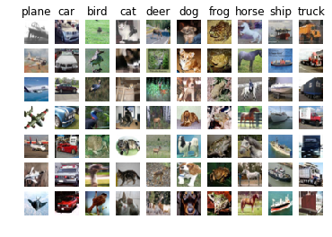
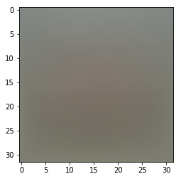
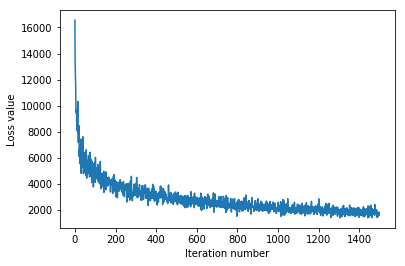

## This is the svm workbook for ECE 239AS Assignment #2

Please follow the notebook linearly to implement a linear support vector machine.

Please print out the workbook entirely when completed.

We thank Serena Yeung & Justin Johnson for permission to use code written for the CS 231n class (cs231n.stanford.edu).  These are the functions in the cs231n folders and includes code to preprocess and show the images.  The classifiers used are based off of code prepared for CS 231n as well.

The goal of this workbook is to give you experience with training an SVM classifier via gradient descent.

## Importing libraries and data setup


```python
import numpy as np # for doing most of our calculations
import matplotlib.pyplot as plt# for plotting
from cs231n.data_utils import load_CIFAR10 # function to load the CIFAR-10 dataset.
import pdb

# Load matplotlib images inline
%matplotlib inline

# These are important for reloading any code you write in external .py files.
# see http://stackoverflow.com/questions/1907993/autoreload-of-modules-in-ipython
%load_ext autoreload
%autoreload 2
```


```python
# Set the path to the CIFAR-10 data
cifar10_dir = 'cifar-10-batches-py'
X_train, y_train, X_test, y_test = load_CIFAR10(cifar10_dir)

# As a sanity check, we print out the size of the training and test data.
print('Training data shape: ', X_train.shape)
print('Training labels shape: ', y_train.shape)
print('Test data shape: ', X_test.shape)
print('Test labels shape: ', y_test.shape)
```

    Training data shape:  (50000, 32, 32, 3)
    Training labels shape:  (50000,)
    Test data shape:  (10000, 32, 32, 3)
    Test labels shape:  (10000,)


```python
# Visualize some examples from the dataset.
# We show a few examples of training images from each class.
classes = ['plane', 'car', 'bird', 'cat', 'deer', 'dog', 'frog', 'horse', 'ship', 'truck']
num_classes = len(classes)
samples_per_class = 7
for y, cls in enumerate(classes):
    idxs = np.flatnonzero(y_train == y)
    idxs = np.random.choice(idxs, samples_per_class, replace=False)
    for i, idx in enumerate(idxs):
        plt_idx = i * num_classes + y + 1
        plt.subplot(samples_per_class, num_classes, plt_idx)
        plt.imshow(X_train[idx].astype('uint8'))
        plt.axis('off')
        if i == 0:
            plt.title(cls)
plt.show()
```





```python
# Split the data into train, val, and test sets. In addition we will
# create a small development set as a subset of the training data;
# we can use this for development so our code runs faster.
num_training = 49000
num_validation = 1000
num_test = 1000
num_dev = 500

# Our validation set will be num_validation points from the original
# training set.
mask = range(num_training, num_training + num_validation)
X_val = X_train[mask]
y_val = y_train[mask]

# Our training set will be the first num_train points from the original
# training set.
mask = range(num_training)
X_train = X_train[mask]
y_train = y_train[mask]

# We will also make a development set, which is a small subset of
# the training set.
mask = np.random.choice(num_training, num_dev, replace=False)
X_dev = X_train[mask]
y_dev = y_train[mask]

# We use the first num_test points of the original test set as our
# test set.
mask = range(num_test)
X_test = X_test[mask]
y_test = y_test[mask]

print('Train data shape: ', X_train.shape)
print('Train labels shape: ', y_train.shape)
print('Validation data shape: ', X_val.shape)
print('Validation labels shape: ', y_val.shape)
print('Test data shape: ', X_test.shape)
print('Test labels shape: ', y_test.shape)
print('Dev data shape: ', X_dev.shape)
print('Dev labels shape: ', y_dev.shape)
```

    Train data shape:  (49000, 32, 32, 3)
    Train labels shape:  (49000,)
    Validation data shape:  (1000, 32, 32, 3)
    Validation labels shape:  (1000,)
    Test data shape:  (1000, 32, 32, 3)
    Test labels shape:  (1000,)
    Dev data shape:  (500, 32, 32, 3)
    Dev labels shape:  (500,)


```python
# Preprocessing: reshape the image data into rows
X_train = np.reshape(X_train, (X_train.shape[0], -1))
X_val = np.reshape(X_val, (X_val.shape[0], -1))
X_test = np.reshape(X_test, (X_test.shape[0], -1))
X_dev = np.reshape(X_dev, (X_dev.shape[0], -1))

# As a sanity check, print out the shapes of the data
print('Training data shape: ', X_train.shape)
print('Validation data shape: ', X_val.shape)
print('Test data shape: ', X_test.shape)
print('dev data shape: ', X_dev.shape)
```

    Training data shape:  (49000, 3072)
    Validation data shape:  (1000, 3072)
    Test data shape:  (1000, 3072)
    dev data shape:  (500, 3072)


```python
# Preprocessing: subtract the mean image
# first: compute the image mean based on the training data
mean_image = np.mean(X_train, axis=0)
print(mean_image[:10]) # print a few of the elements
plt.figure(figsize=(4,4))
plt.imshow(mean_image.reshape((32,32,3)).astype('uint8')) # visualize the mean image
plt.show()
```

    [ 130.64189796  135.98173469  132.47391837  130.05569388  135.34804082
      131.75402041  130.96055102  136.14328571  132.47636735  131.48467347]





```python
# second: subtract the mean image from train and test data
X_train -= mean_image
X_val -= mean_image
X_test -= mean_image
X_dev -= mean_image
```


```python
# third: append the bias dimension of ones (i.e. bias trick) so that our SVM
# only has to worry about optimizing a single weight matrix W.
X_train = np.hstack([X_train, np.ones((X_train.shape[0], 1))])
X_val = np.hstack([X_val, np.ones((X_val.shape[0], 1))])
X_test = np.hstack([X_test, np.ones((X_test.shape[0], 1))])
X_dev = np.hstack([X_dev, np.ones((X_dev.shape[0], 1))])

print(X_train.shape, X_val.shape, X_test.shape, X_dev.shape)
```

    (49000, 3073) (1000, 3073) (1000, 3073) (500, 3073)


## Question:

(1) For the SVM, we perform mean-subtraction on the data.
However, for the KNN notebook, we did not.
Why?


## Answer:

(1) In SVM, our scores, and therefore our predictions for our classes, are going to determined by linear combinations of our features with weights, such as $w_ix_i$ for a specific weight/feature combination. This means that if one feature has very large values, then it will influence the classification a lot more than the other features, but if all the features are on the same scale, then this will not occur. We did not need to do this for KNN since KNN makes predicitions based on the neighbors with closest distances, and the distances themselves will have the same relative ordering regardless of if we scale features up or down uniformly across the dataset, so mean subtraction would not change what the KNN predicts.

## Training an SVM

The following cells will take you through building an SVM.  You will implement its loss function, then subsequently train it with gradient descent.  Finally, you will choose the learning rate of gradient descent to optimize its classification performance.


```python
from nndl.svm import SVM
```


```python
# Declare an instance of the SVM class.  
# Weights are initialized to a random value.
# Note, to keep people's initial solutions consistent, we are going to use a random seed.

np.random.seed(1)

num_classes = len(np.unique(y_train))
num_features = X_train.shape[1]

svm = SVM(dims=[num_classes, num_features])
```

#### SVM loss


```python
## Implement the loss function for in the SVM class(nndl/svm.py), svm.loss()

loss = svm.loss(X_train, y_train)
print('The training set loss is {}.'.format(loss))

# If you implemented the loss correctly, it should be 15569.98
```

    The training set loss is 15569.97791541019.


#### SVM gradient


```python
## Calculate the gradient of the SVM class.
# For convenience, we'll write one function that computes the loss
#   and gradient together. Please modify svm.loss_and_grad(X, y).
# You may copy and paste your loss code from svm.loss() here, and then
#   use the appropriate intermediate values to calculate the gradient.

loss, grad = svm.loss_and_grad(X_dev,y_dev)
print(loss)
# Compare your gradient to a numerical gradient check. 
# You should see relative gradient errors on the order of 1e-07 or less if you implemented the gradient correctly.
svm.grad_check_sparse(X_dev, y_dev, grad)
```

    15431.6117988
    numerical: -10.071826 analytic: -10.071826, relative error: 2.275427e-08
    numerical: 6.509800 analytic: 6.509800, relative error: 2.755785e-08
    numerical: -0.886501 analytic: -0.886501, relative error: 2.587231e-07
    numerical: 3.802422 analytic: 3.802422, relative error: 3.724579e-08
    numerical: -9.323489 analytic: -9.323489, relative error: 2.509547e-08
    numerical: 5.602462 analytic: 5.602462, relative error: 2.775571e-08
    numerical: 4.339594 analytic: 4.339595, relative error: 7.390497e-08
    numerical: -12.396901 analytic: -12.396901, relative error: 3.065738e-09
    numerical: -9.335607 analytic: -9.335607, relative error: 4.470406e-09
    numerical: -17.778925 analytic: -17.778926, relative error: 2.487988e-08


## A vectorized version of SVM

To speed things up, we will vectorize the loss and gradient calculations.  This will be helpful for stochastic gradient descent.


```python
import time
```


```python
## Implement svm.fast_loss_and_grad which calculates the loss and gradient
#    WITHOUT using any for loops.  

# Standard loss and gradient
tic = time.time()
loss, grad = svm.loss_and_grad(X_dev, y_dev)
toc = time.time()
print('Normal loss / grad_norm: {} / {} computed in {}s'.format(loss, np.linalg.norm(grad, 'fro'), toc - tic))

tic = time.time()
loss_vectorized, grad_vectorized = svm.fast_loss_and_grad(X_dev, y_dev)
toc = time.time()
print('Vectorized loss / grad: {} / {} computed in {}s'.format(loss_vectorized, np.linalg.norm(grad_vectorized, 'fro'), toc - tic))

# The losses should match but your vectorized implementation should be much faster.
print('difference in loss / grad: {} / {}'.format(loss - loss_vectorized, np.linalg.norm(grad - grad_vectorized)))

# You should notice a speedup with the same output, i.e., differences on the order of 1e-12
```

    Normal loss / grad_norm: 15431.611798772026 / 2272.736768867464 computed in 0.05608487129211426s
    Vectorized loss / grad: 15431.611798772023 / 2272.7367688674635 computed in 0.019289016723632812s
    difference in loss / grad: 3.637978807091713e-12 / 9.028510448517017e-12


## Stochastic gradient descent

We now implement stochastic gradient descent.  This uses the same principles of gradient descent we discussed in class, however, it calculates the gradient by only using examples from a subset of the training set (so each gradient calculation is faster).


```python
# Implement svm.train() by filling in the code to extract a batch of data
# and perform the gradient step.

tic = time.time()
loss_hist = svm.train(X_train, y_train, learning_rate=5e-4,
                      num_iters=1500, verbose=True)
toc = time.time()
print('That took {}s'.format(toc - tic))

plt.plot(loss_hist)
plt.xlabel('Iteration number')
plt.ylabel('Loss value')
plt.show()
```

    iteration 0 / 1500: loss 16557.38000190916
    iteration 100 / 1500: loss 4701.089451272714
    iteration 200 / 1500: loss 4017.333137942788
    iteration 300 / 1500: loss 3681.9226471953625
    iteration 400 / 1500: loss 2732.6164373988986
    iteration 500 / 1500: loss 2786.637842464506
    iteration 600 / 1500: loss 2837.0357842782664
    iteration 700 / 1500: loss 2206.2348687399317
    iteration 800 / 1500: loss 2269.03882411698
    iteration 900 / 1500: loss 2543.23781538592
    iteration 1000 / 1500: loss 2566.692135726826
    iteration 1100 / 1500: loss 2182.068905905164
    iteration 1200 / 1500: loss 1861.1182244250447
    iteration 1300 / 1500: loss 1982.9013858528256
    iteration 1400 / 1500: loss 1927.5204158582114
    That took 11.144428014755249s





### Evaluate the performance of the trained SVM on the validation data.


```python
## Implement svm.predict() and use it to compute the training and testing error.

y_train_pred = svm.predict(X_train)
print('training accuracy: {}'.format(np.mean(np.equal(y_train,y_train_pred), )))
y_val_pred = svm.predict(X_val)
print('validation accuracy: {}'.format(np.mean(np.equal(y_val, y_val_pred)), ))
```

    training accuracy: 0.28530612244897957
    validation accuracy: 0.3


## Optimize the SVM

Note, to make things faster and simpler, we won't do k-fold cross-validation, but will only optimize the hyperparameters on the validation dataset (X_val, y_val).


```python
# ================================================================ #
# YOUR CODE HERE:
#   Train the SVM with different learning rates and evaluate on the
#     validation data.
#   Report:
#     - The best learning rate of the ones you tested.  
#     - The best VALIDATION accuracy corresponding to the best VALIDATION error.
#
#   Select the SVM that achieved the best validation error and report
#     its error rate on the test set.
#   Note: You do not need to modify SVM class for this section
# ================================================================ #
chosen_rates = [5e-8, 5e-7, 5e-6, 5e-5, 5e-4, 5e-3, 5e-2, 5e-1]
rate_to_err = {}
rate_to_acc = {}
for rate in chosen_rates:
    # train on training data
    svm.train(X_train, y_train, learning_rate=rate,
                      num_iters=1500, verbose=False)
    # predict on validation dataset
    y_val_pred = svm.predict(X_val)
    acc = np.mean(np.equal(y_val, y_val_pred))
    err = 1 - acc
    rate_to_err[rate] = err
    rate_to_acc[rate] = acc
    print('using learning rate = {} validation accuracy: {}, error = {}'.format(rate, acc, err))

best_rate = min(rate_to_err, key = rate_to_err.get)
print('best learning rate: {} and validation accuracy: {} (corresponding to validation error {})'.format(best_rate, rate_to_acc[best_rate], rate_to_err[best_rate]))

# train the best SVM on the training set now
svm.train(X_train, y_train, learning_rate = best_rate, num_iters = 1500, verbose = False)
# predict on the test set now
y_train_pred = svm.predict(X_test)
acc = np.mean(np.equal(y_test, y_train_pred))
err = 1 - acc
print('Testing error for best SVM using learning rate {} is {}'.format(best_rate, err))
# ================================================================ #
# END YOUR CODE HERE
# ================================================================ #

```

    using learning rate = 5e-08 validation accuracy: 0.097, error = 0.903
    using learning rate = 5e-07 validation accuracy: 0.105, error = 0.895
    using learning rate = 5e-06 validation accuracy: 0.173, error = 0.827
    using learning rate = 5e-05 validation accuracy: 0.254, error = 0.746
    using learning rate = 0.0005 validation accuracy: 0.298, error = 0.702
    using learning rate = 0.005 validation accuracy: 0.267, error = 0.733
    using learning rate = 0.05 validation accuracy: 0.281, error = 0.719
    using learning rate = 0.5 validation accuracy: 0.303, error = 0.6970000000000001
    best learning rate: 0.5 and validation accuracy: 0.303 (corresponding to validation error 0.6970000000000001)
    Testing error for best SVM using learning rate 0.5 is 0.728


The best learning rate I found was $0.5$ with a validation accuracy of $0.303$, corresponding to a validation error of $0.697$. 

Predicting on the test set with that learning rate, I got a testing error of $0.728$. 


```python

```
